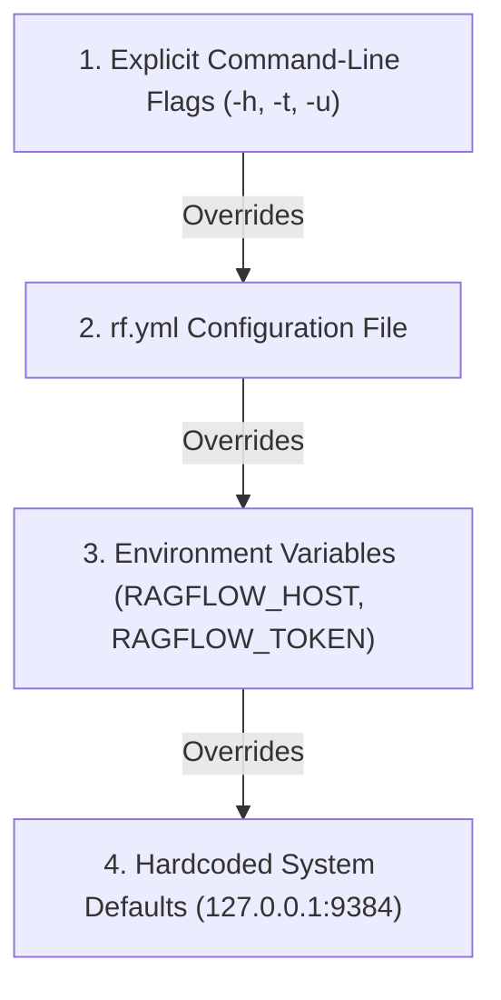

# CLI Configuration

## Level 1: Conceptual Explanation

`ragflow-cli` configuration is governed by a multi-tiered hierarchy. Settings can be specified via command-line flags, environment variables, local YAML configuration files (`rf.yml`), or dynamic REPL session overrides. This structure ensures flexibility for local developer debugging, automated container scripts, and production administrator operations.

---

## Level 2: Implementation Details

### Configuration File Schema (`rf.yml`)

The CLI natively searches for a local configuration file named `rf.yml` (or an absolute path specified via `-f / --config`).

```yaml
host: "127.0.0.1:9384"
api_key: "ragflow-xxxxxxxxxxxxxxxxxxxxxxxxxxxxxxxx"
user_name: "admin@ragflow.io"
password: "secretpassword"

api_servers:
  dev:
    name: "Development Server"
    host: "192.168.1.100:9384"
    api_key: "ragflow-dev-key"
  prod:
    name: "Production Cluster"
    host: "ragflow.company.com:443"
    api_key: "ragflow-prod-key"
```

Defined in Go structs ([`internal/cli/cli.go#L37-L56`](file:///home/logan78/Desktop/ragflow/internal/cli/cli.go#L37-L56)):
```go
type APIServerConfig struct {
	Name         string  `yaml:"name"`
	Host         string  `yaml:"host"`
	UserName     *string `yaml:"user_name"`
	UserPassword *string `yaml:"password"`
	APIKey       *string `yaml:"api_key"`
	KeyFile      *string `yaml:"key_file"`
	IP           string
	Port         int
}

type ConfigFile struct {
	Host         string                      `yaml:"host"`
	APIKey       string                      `yaml:"api_key"`
	UserName     string                      `yaml:"user_name"`
	Password     string                      `yaml:"password"`
	APIServerMap map[string]*APIServerConfig `yaml:"api_servers"`
}
```

---

### Command-Line Arguments Specification

Parsed by [`ParseArgs()`](file:///home/logan78/Desktop/ragflow/internal/cli/cli.go#L108-L350):

| Option Flag | Long Flag | Default Value | Description | Source Reference |
| :--- | :--- | :--- | :--- | :--- |
| `-h` | `--host` | `127.0.0.1:9384` (API) / `127.0.0.1:9383` (Admin) | Server IP address and port | [`cli.go:L186`](file:///home/logan78/Desktop/ragflow/internal/cli/cli.go#L186) |
| `-t` | `--token` | `""` | User API Key / Bearer Token | [`cli.go:L197`](file:///home/logan78/Desktop/ragflow/internal/cli/cli.go#L197) |
| `-u` | `--user` | `""` | User login email address | [`cli.go:L202`](file:///home/logan78/Desktop/ragflow/internal/cli/cli.go#L202) |
| `-p` | `--password` | `""` | User login password | [`cli.go:L207`](file:///home/logan78/Desktop/ragflow/internal/cli/cli.go#L207) |
| `-f` | `--config` | `rf.yml` | Path to YAML configuration file | [`cli.go:L212`](file:///home/logan78/Desktop/ragflow/internal/cli/cli.go#L212) |
| `-o` | `--output` | `table` | Output format (`table`, `plain`, `json`) | [`cli.go:L121`](file:///home/logan78/Desktop/ragflow/internal/cli/cli.go#L121) |
| `-v` | `--verbose` | `false` | Enables info-level verbose logging | [`cli.go:L136`](file:///home/logan78/Desktop/ragflow/internal/cli/cli.go#L136) |
| `-admin` | `--admin` | `false` | Enables Admin Mode (port 9383/9381) | [`cli.go:L138`](file:///home/logan78/Desktop/ragflow/internal/cli/cli.go#L138) |
| `--help` | `-help` | `false` | Prints CLI usage guidelines | [`cli.go:L140`](file:///home/logan78/Desktop/ragflow/internal/cli/cli.go#L140) |

---

### Precedence Resolution Hierarchy

When resolving configuration settings (e.g. Host, API Key, Port), `ragflow-cli` evaluates sources in the following order:



---

## References & Source Links

- [`internal/cli/cli.go:L37-L100`](file:///home/logan78/Desktop/ragflow/internal/cli/cli.go#L37-L100) - Configuration structs and constants.
- [`internal/cli/cli.go:L108-L350`](file:///home/logan78/Desktop/ragflow/internal/cli/cli.go#L108-L350) - Flag parsing and YAML unmarshaling logic.
