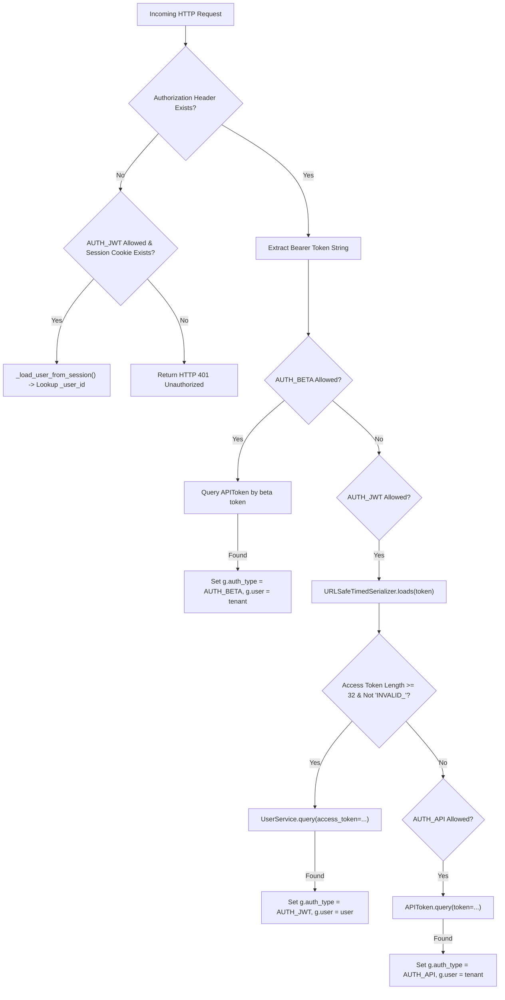

# Complete Authentication Model

## Level 1: Multi-Channel Authentication Overview

RAGFlow implements an enterprise multi-channel authentication model across its dual-stack Go and Python API backends.

```
+-----------------------------------------------------------------------------------+
| AUTHENTICATION GATEWAY CHANNELS                                                    |
+-----------------------------------------------------------------------------------+
| 1. JWT Access Tokens: `Authorization: Bearer <jwt_token>`                         |
| 2. Programmatic API Tokens: `Authorization: Bearer <api_token>`                   |
| 3. SDK Beta Tokens: `Authorization: Bearer <beta_token>`                          |
| 4. Redis Session Cookie: Session cookie fallback `_user_id`                       |
| 5. Third-Party OAuth2 / OIDC: GitHub, Google, Enterprise OpenID Connect           |
+-----------------------------------------------------------------------------------+
```

---

## Level 2: Python & Go Authentication Implementation

### 1. Python Quart Authentication Pipeline ([`api/apps/__init__.py:L144`](file:///home/logan78/Desktop/ragflow/api/apps/__init__.py#L144))



### 2. Go Gin Authentication Middleware ([`internal/handler/auth.go`](file:///home/logan78/Desktop/ragflow/internal/handler/auth.go))

- `AuthMiddleware()`: Intercepts standard user routes (`/v1/user/info`, `/v1/tenant/list`), decodes tokens, and attaches user context (`c.Set("user", user)`).
- `BetaAuthMiddleware()`: Intercepts public bot routes (`/api/v1/searchbots/*`, `/api/v1/chatbots/*`, `/api/v1/mcp`).

### Key Source References

- Python Auth Logic: [`api/apps/__init__.py`](file:///home/logan78/Desktop/ragflow/api/apps/__init__.py#L98-L220)
- User Database Service: [`api/db/services/user_service.py`](file:///home/logan78/Desktop/ragflow/api/db/services/user_service.py#L33)
- Go Auth Middleware: [`internal/handler/auth.go`](file:///home/logan78/Desktop/ragflow/internal/handler/auth.go)
- Frontend Auth Interceptor: [`web/src/utils/authorization-util.ts`](file:///home/logan78/Desktop/ragflow/web/src/utils/authorization-util.ts)
