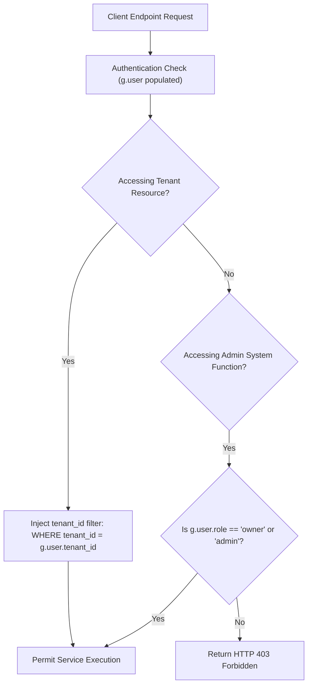

# Complete Authorization Model

## Level 1: Multi-Tenant Authorization Architecture

Authorization in RAGFlow operates at two distinct boundaries:

1. **Workspace Multi-Tenancy Boundary (`tenant_id`)**: Every data resource (dataset, document, task, chat session, agent canvas workflow) belongs to a specific tenant workspace. All database queries automatically append `WHERE tenant_id = g.user.tenant_id` to guarantee tenant isolation.
2. **User Role Boundary (`role`)**: Users within a tenant workspace are assigned roles (`owner`, `admin`, `normal`), governing administrative capabilities such as inviting team members, modifying LLM API provider keys, or altering system configurations.

---

## Level 2: Authorization Enforcement in Code

### Source Code Implementation Matrix

| Authorization Type | Target Resource | Source File Reference | Code Logic |
| :--- | :--- | :--- | :--- |
| **Tenant Isolation** | Datasets & Documents | [`api/db/services/knowledgebase_service.py`](file:///home/logan78/Desktop/ragflow/api/db/services/knowledgebase_service.py) | Filters Peewee queries by `Knowledgebase.tenant_id == user.tenant_id`. |
| **Tenant Isolation** | DocStore Vector Indexes | [`rag/utils/`](file:///home/logan78/Desktop/ragflow/rag/utils) | Embeds `tenant_id` filter into vector search payloads. |
| **Role Verification**| Team Settings & Keys | [`api/apps/restful_apis/tenant_api.py`](file:///home/logan78/Desktop/ragflow/api/apps/restful_apis/tenant_api.py) | Verifies user role before permitting API key rotation. |
| **Role Verification**| Admin Dashboard | [`internal/admin/handler.go`](file:///home/logan78/Desktop/ragflow/internal/admin/handler.go) | Restricts access to system metrics to admin users. |
