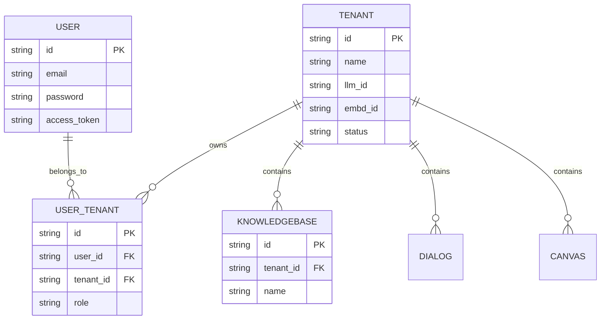

# Multi-Tenancy Architecture

## Level 1: Conceptual Multi-Tenancy Design

RAGFlow provides strict multi-tenancy isolation for enterprise deployments. A tenant represents an organization or isolated team workspace.

### Key Characteristics

1. **Workspace Multi-Tenancy**: Multiple users can belong to a single tenant workspace, sharing datasets, documents, models, and agent workflows.
2. **Tenant ID Scoping**: Every database entity (`Knowledgebase`, `Document`, `Task`, `Dialog`, `Canvas`) references a `tenant_id` string foreign key.
3. **Search Engine Scoping**: DocStore vector indexes (Infinity, Elasticsearch, OpenSearch, OceanBase, Qdrant, Milvus) index chunks with `tenant_id` fields, guaranteeing that vector search queries never leak data across tenants.

---

## Level 2: Database Schema & Source Implementation

### Source File References

- User & Tenant Database Models: [`api/db/db_models.py`](file:///home/logan78/Desktop/ragflow/api/db/db_models.py)
- User Tenant Association Service: [`api/db/services/user_service.py`](file:///home/logan78/Desktop/ragflow/api/db/services/user_service.py#L33)
- Go Tenant DAO: [`internal/dao/tenant.go`](file:///home/logan78/Desktop/ragflow/internal/dao/tenant.go)
- Go Tenant Service: [`internal/service/tenant.go`](file:///home/logan78/Desktop/ragflow/internal/service/tenant.go)
- DocStore Scoping Adapter: [`rag/utils/`](file:///home/logan78/Desktop/ragflow/rag/utils)
