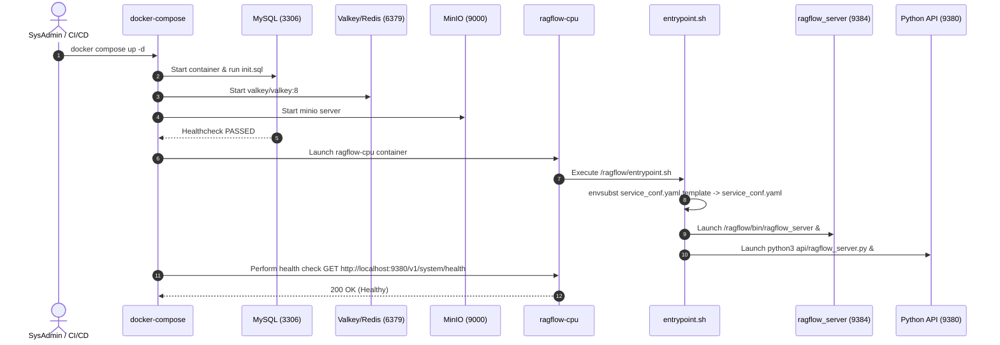

# Deployment Lifecycle & Execution Flow

## Level 1: Conceptual Explanation

The deployment lifecycle governs how RAGFlow containers boot, initialize dependent storage systems, populate initial database schemas, generate dynamic environment configurations, start background workers, and transition into a healthy operating state.

---

## Level 2: Implementation Details

### Initialization Sequence

1. **Pre-flight Container Dependency Checks**:
   - `ragflow-cpu` waits for `mysql` health check (`mysqladmin ping`).
   - `mysql` executes [`docker/init.sql`](file:///home/logan78/Desktop/ragflow/docker/init.sql) on first boot to create relational schemas (`user`, `tenant`, `knowledgebase`, `document`, `task`).
2. **Environment Configuration Interpolation (`entrypoint.sh`)**:
   - [`docker/entrypoint.sh`](file:///home/logan78/Desktop/ragflow/docker/entrypoint.sh) parses template variables.
3. **Daemon Subsystem Startup**:
   - Nginx starts in background: `nginx`.
   - Python Web API launches: `python3 api/ragflow_server.py`.
   - Python Admin server launches (if `--enable-adminserver` flag is present).
4. **Healthcheck Validation**:
   - Docker daemon polls `HTTP GET http://localhost:9380/v1/system/health` every 10 seconds until health check passes.

---

## Deployment Lifecycle Sequence Diagram

---

## References & Source Links

- [`docker/entrypoint.sh:L1-L80`](file:///home/logan78/Desktop/ragflow/docker/entrypoint.sh#L1-L80) - Main container startup script.
- [`docker/docker-compose.yml:L22-L50`](file:///home/logan78/Desktop/ragflow/docker/docker-compose.yml#L22-L50) - Container startup order and health check rules.
- [`docker/init.sql:L1-L100`](file:///home/logan78/Desktop/ragflow/docker/init.sql#L1-L100) - Initial DB schema script.
