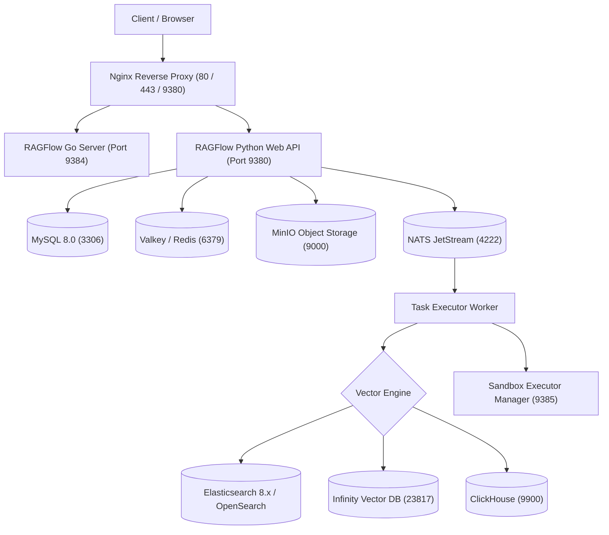

# Deployment Overview

## Level 1: Conceptual Explanation

RAGFlow is designed for enterprise-grade, high-availability multi-service deployment. Its deployment model supports single-node evaluation setups via Docker Compose to distributed multi-node production clusters using Kubernetes and Helm charts.

### Core Deployment Profiles
- **CPU Profile (`ragflow-cpu`)**: Evaluates/runs core Python server services, Go server instances, Nginx reverse proxy, MySQL, Valkey/Redis, MinIO, NATS message queue, and Elasticsearch/Infinity search engines on standard CPU infrastructure.
- **GPU Profile (`ragflow-gpu`)**: Enables NVIDIA CUDA acceleration for local deep learning models (DocParser, OCR, TEI embedding, reranking models).
- **Sandbox Execution Profile (`sandbox`)**: Spawns isolated code execution environments (`sandbox-executor-manager`) for secure execution of LLM-generated Python/Node.js code.
- **DeepDoc Profile (`deepdoc`)**: Dedicated container service for document layout parsing (`Dockerfile_deepdoc_oss`).

---

## Level 2: Implementation Details

### Architecture & Repository Map

Deployment files are organized across the repository:

```
docker/
├── docker-compose.yml              # Main compose orchestrator (cpu, gpu profiles)
├── docker-compose-base.yml         # Shared infrastructure services (DB, Redis, MinIO, ES, Infinity)
├── docker-compose-CN-oc9.yml       # Optimized image deployment for China mirror regions
├── docker-compose-macos.yml        # macOS Docker Desktop optimization
├── service_conf.yaml.template      # Production environment configuration template
├── init.sql                        # MySQL initial database schema
├── init-clickhouse.sql             # ClickHouse initial table definitions
├── entrypoint.sh                   # Main API server container startup script
└── entrypoint_task_executor.sh     # Standalone task executor startup script

/
├── Dockerfile                      # Main RAGFlow production multi-stage image
├── Dockerfile_base                 # Python base dependencies & native C++ libraries
├── Dockerfile_deepdoc_oss          # DeepDoc layout parser container
├── Dockerfile_tei                  # Text Embeddings Inference engine container
├── build.sh                        # Go & C++ CGO binary build script
└── conf/service_conf.yaml          # Local runtime service configuration
```

---

## Service Component Breakdown



---

## References & Source Links

- [`docker/docker-compose.yml:L1-L150`](file:///home/logan78/Desktop/ragflow/docker/docker-compose.yml#L1-L150) - Main orchestrator composition.
- [`docker/docker-compose-base.yml:L1-L428`](file:///home/logan78/Desktop/ragflow/docker/docker-compose-base.yml#L1-L428) - Infrastructure services specification.
- [`Dockerfile:L1-L120`](file:///home/logan78/Desktop/ragflow/Dockerfile#L1-L120) - Production container image definition.
- [`build.sh:L1-L200`](file:///home/logan78/Desktop/ragflow/build.sh#L1-L200) - Go binary and CGO library builder.
