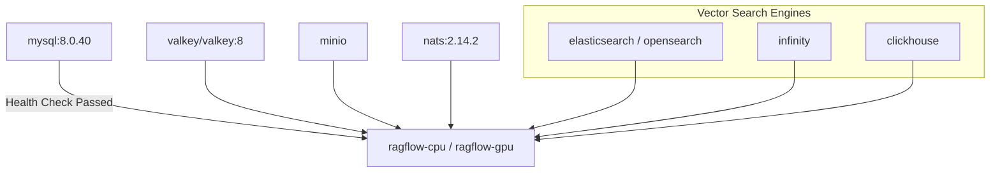

# Docker Compose Topology

## Level 1: Conceptual Explanation

RAGFlow provides standard Docker Compose manifests (`docker/docker-compose.yml` and `docker/docker-compose-base.yml`) that orchestrate the full multi-container service topology. 

Docker Compose profiles allow selectively deploying required infrastructure tiers:
- **`cpu`**: Deploys `ragflow-cpu` main application container.
- **`gpu`**: Deploys `ragflow-gpu` container with NVIDIA GPU runtime pass-through.
- **`elasticsearch` / `opensearch` / `infinity` / `serenedb` / `oceanbase` / `seekdb`**: Selects vector search engine backends.
- **`sandbox`**: Enables isolated code execution containers.
- **`deepdoc`**: Enables dedicated layout parsing service.
- **`ragflow-go`**: Enables Go backend microservices (e.g. NATS worker integration).

---

## Level 2: Implementation Details

### Composition Topology Overview

The deployment orchestrates two files:
1. **`docker/docker-compose.yml`**: Includes `./docker-compose-base.yml` and defines top-level application containers (`ragflow-cpu`, `ragflow-gpu`, `deepdoc`).
2. **`docker/docker-compose-base.yml`**: Defines core storage, caching, messaging, and search engines.

```
docker-compose.yml
├── include: docker-compose-base.yml
├── service: deepdoc (Profile: deepdoc, Port: 9390)
├── service: ragflow-cpu (Profile: cpu, Ports: 80, 443, 9380, 9381, 9382, 9383, 9384)
└── service: ragflow-gpu (Profile: gpu, NVIDIA CUDA pass-through)
```

---

## Complete Multi-Service Composition Table

Defined in [`docker/docker-compose-base.yml`](file:///home/logan78/Desktop/ragflow/docker/docker-compose-base.yml#L1-L428) and [`docker/docker-compose.yml`](file:///home/logan78/Desktop/ragflow/docker/docker-compose.yml#L1-L152):

| Service Name | Profile | Image / Tag | Internal Port | Mapped Host Port Variable | Volume Mounts | Healthcheck Test |
| :--- | :--- | :--- | :--- | :--- | :--- | :--- |
| **`ragflow-cpu`** | `cpu` | `${RAGFLOW_IMAGE}` | `80`, `443`, `9380`, `9381`, `9382`, `9383`, `9384` | `${SVR_HTTP_PORT}:9380`, `${GO_HTTP_PORT}:9384` | `./ragflow-logs:/ragflow/logs`, `./service_conf.yaml.template:...` | Depends on `mysql:healthy` |
| **`ragflow-gpu`** | `gpu` | `${RAGFLOW_IMAGE}` | `80`, `443`, `9380`, `9381`, `9382` | `${SVR_HTTP_PORT}:9380` | GPU pass-through (`nvidia.driver`) | Depends on `mysql:healthy` |
| **`deepdoc`** | `deepdoc` | `${DEEPDOC_IMAGE}` | `9390` | Internal | None | `curl -f http://localhost:9390/health` |
| **`mysql`** | default | `mysql:8.0.40` | `3306` | `${EXPOSE_MYSQL_PORT}:3306` | `mysql_data:/var/lib/mysql`, `./init.sql:...` | `mysqladmin ping -uroot -p...` |
| **`minio`** | default | `pgsty/minio:RELEASE.2026-03-25...` | `9000`, `9001` | `${MINIO_PORT}:9000`, `${MINIO_CONSOLE_PORT}:9001` | `minio_data:/data` | `curl -f http://localhost:9000/minio/health/live` |
| **`redis`** | default | `valkey/valkey:8` | `6379` | `${REDIS_PORT}:6379` | `redis_data:/data` | `redis-cli -a ${REDIS_PASSWORD} ping` |
| **`nats`** | `ragflow-go` | `nats:2.14.2` | `4222`, `8222` | `${NATS_PORT:-4222}:4222` | `nats_data:/data` | `nats-server --health-check` |
| **`infinity`** | `infinity` | `infiniflow/infinity:v0.7.2-x64-v3` | `23817`, `23820`, `5432` | `${INFINITY_THRIFT_PORT}:23817` | `infinity_data:/var/infinity`, `./infinity_conf.toml:...` | `curl http://localhost:23820/admin/node/current` |
| **`es01`** | `elasticsearch` | `elasticsearch:${STACK_VERSION}` | `9200` | `${ES_PORT}:9200` | `esdata01:/usr/share/elasticsearch/data` | `curl http://localhost:9200` |
| **`opensearch01`** | `opensearch` | `opensearchproject/opensearch:2.19.1` | `9201` | `${OS_PORT}:9201` | `osdata01:/usr/share/opensearch/data` | `curl http://localhost:9201` |
| **`serenedb`** | `serenedb` | `serenedb/serenedb:26.07.5` | `7890` | `${SERENEDB_PORT}:7890` | `serenedb_data:/var/lib/serenedb` | `pg_isready -h 127.0.0.1 -p 7890` |
| **`clickhouse`** | `clickhouse` | `clickhouse/clickhouse-server:26.5.5.8` | `9000`, `8123` | `${CLICKHOUSE_TCP_PORT}:9000` | `clickhouse_data:...`, `./init-clickhouse.sql:...` | `clickhouse-client -q 'SELECT 1'` |
| **`sandbox-executor-manager`** | `sandbox` | `infiniflow/sandbox-executor-manager` | `9385` | `${SANDBOX_EXECUTOR_MANAGER_PORT}:9385` | `/var/run/docker.sock:/var/run/docker.sock` | `curl http://localhost:9385/healthz` |

---

## Service Inter-Dependency Sequence



---

## References & Source Links

- [`docker/docker-compose.yml:L1-L152`](file:///home/logan78/Desktop/ragflow/docker/docker-compose.yml#L1-L152) - Primary multi-service compose file.
- [`docker/docker-compose-base.yml:L1-L428`](file:///home/logan78/Desktop/ragflow/docker/docker-compose-base.yml#L1-L428) - Infrastructure services compose manifest.
