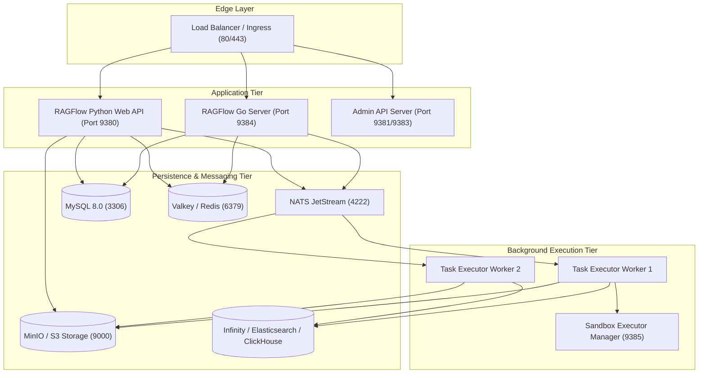

# Production Architecture

## Level 1: Conceptual Explanation

RAGFlow production architecture is organized into distinct decoupled layers:
1. **Edge / Ingress Layer**: Public facing Nginx load balancer providing SSL termination, HTTP/2 streaming, and path-based routing (`/v1/` to Web API, `/mcp` to Model Context Protocol server).
2. **Application Server Layer**: Dual-core architecture comprising the high-concurrency Go REST API server (`ragflow_server` on port 9384) and the Python Flask API server (port 9380).
3. **Async Task Execution Layer**: Distributed task executors consuming background jobs (document layout parsing, OCR, chunk embedding generation, web scraping) from NATS JetStream queues.
4. **Storage & Data Layer**: MySQL 8.0 for relational metadata, Valkey/Redis for caching and session state, MinIO/S3/GCS/Azure for binary object files, and vector/hybrid search engines (Infinity, Elasticsearch, OpenSearch, ClickHouse, OceanBase).
5. **Code Execution Sandbox**: Isolated Docker container pool (`sandbox-executor-manager`) for running arbitrary LLM-generated code snippets under resource constraints.

---

## Level 2: Implementation Details

### Component Topologies & Specifications

| Tier Component | Container / Process | Primary Port | Config Source | Healthcheck Endpoint |
| :--- | :--- | :--- | :--- | :--- |
| **Go API Server** | `ragflow-cpu` (`ragflow_server`) | `9384` | [`conf/service_conf.yaml:L3-L5`](file:///home/logan78/Desktop/ragflow/conf/service_conf.yaml#L3-L5) | `HTTP GET /v1/system/health` |
| **Python Web API** | `ragflow-cpu` (`entrypoint.sh`) | `9380` | [`conf/service_conf.yaml:L3-L5`](file:///home/logan78/Desktop/ragflow/conf/service_conf.yaml#L3-L5) | `HTTP GET /v1/system/health` |
| **Admin API Server** | `ragflow-cpu` (admin mode) | `9381`, `9383` | [`conf/service_conf.yaml:L6-L8`](file:///home/logan78/Desktop/ragflow/conf/service_conf.yaml#L6-L8) | `HTTP GET /v1/admin/health` |
| **Relational DB** | `mysql` (MySQL 8.0.40) | `3306` | [`conf/service_conf.yaml:L9-L17`](file:///home/logan78/Desktop/ragflow/conf/service_conf.yaml#L9-L17) | `mysqladmin ping` |
| **Cache & Session** | `redis` (Valkey 8) | `6379` | [`conf/service_conf.yaml:L48-L52`](file:///home/logan78/Desktop/ragflow/conf/service_conf.yaml#L48-L52) | `redis-cli ping` |
| **Object Store** | `minio` | `9000`, `9001` | [`conf/service_conf.yaml:L18-L23`](file:///home/logan78/Desktop/ragflow/conf/service_conf.yaml#L18-L23) | `HTTP GET /minio/health/live` |
| **Message Queue** | `nats` (NATS 2.14) | `4222`, `8222` | [`conf/service_conf.yaml:L53-L55`](file:///home/logan78/Desktop/ragflow/conf/service_conf.yaml#L53-L55) | `nats-server --health-check` |
| **Vector Engine** | `infinity` / `es01` / `clickhouse` | `23817`, `9200`, `9900` | [`conf/service_conf.yaml:L24-L47`](file:///home/logan78/Desktop/ragflow/conf/service_conf.yaml#L24-L47) | Engine dependent |
| **Code Sandbox** | `sandbox-executor-manager` | `9385` | `docker-compose-base.yml:L180` | `HTTP GET /healthz` |

---

## Production Deployment Topology

---

## References & Source Links

- [`docker/docker-compose.yml:L1-L152`](file:///home/logan78/Desktop/ragflow/docker/docker-compose.yml#L1-L152) - Container service composition.
- [`docker/docker-compose-base.yml:L1-L428`](file:///home/logan78/Desktop/ragflow/docker/docker-compose-base.yml#L1-L428) - Backend infrastructure definition.
- [`conf/service_conf.yaml:L1-L100`](file:///home/logan78/Desktop/ragflow/conf/service_conf.yaml#L1-L100) - Production configuration options.
