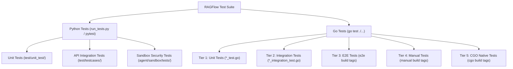

# Testing Overview

## Level 1: Conceptual Explanation

RAGFlow implements a multi-layered verification strategy spanning Python backend unit/integration tests, Go core server unit/integration/benchmark tests, CGO native library tests, and end-to-end (E2E) API validation.

### Testing Objectives & Principles
1. **Python Test Suite**: Managed via [`run_tests.py`](file:///home/logan78/Desktop/ragflow/run_tests.py) and `pytest`, covering API services, chunkers, dialog services, LLM providers, and agent sandbox security.
2. **Go Test Suite**: Utilizes standard `go test` and CGO bindings, categorized into 5 distinct tiers: `unit`, `integration`, `e2e`, `manual`, and `cgo`.
3. **Automated Coverage & Parallelism**: Supports parallel execution (`pytest-xdist`, `go test -parallel`) and generates HTML coverage reports (`coverage.py` / `go tool cover`).

---

## Level 2: Implementation Details

### Architecture & Repository Test Map

```
/
├── run_tests.py                            # Central Python test runner script
├── test/
│   ├── unit_test/                          # Pytest backend unit test suite
│   │   ├── services/                       # Service layer unit tests
│   │   ├── api/                            # API endpoint unit tests
│   │   └── rag/                            # Retrieval and parser unit tests
│   ├── benchmark/                          # Performance & latency benchmarks
│   └── testcases/                          # E2E RESTful API test scenarios
├── agent/sandbox/tests/
│   ├── test_security.py                    # Code execution security checks
│   └── sandbox_security_tests_full.py       # Full sandbox isolation tests
└── internal/                               # Go testing files (*_test.go)
    ├── cli/user_parser_test.go             # CLI parser tests
    ├── agent/canvas/state_bench_test.go    # Canvas state benchmarks
    ├── agent/sandbox/manager_client_test.go # Sandbox RPC client tests
    └── deepdoc/parser/pdf/inference_client_integration_test.go # CGO integration tests
```

---

## Test Execution Hierarchy



---

## References & Source Links

- [`run_tests.py:L1-L358`](file:///home/logan78/Desktop/ragflow/run_tests.py#L1-L358) - Python test runner implementation.
- [`internal/cli/user_parser_test.go:L1-L100`](file:///home/logan78/Desktop/ragflow/internal/cli/user_parser_test.go#L1-L100) - CLI parser unit test.
- [`agent/sandbox/tests/test_security.py:L1-L80`](file:///home/logan78/Desktop/ragflow/agent/sandbox/tests/test_security.py#L1-L80) - Code execution security unit test.
