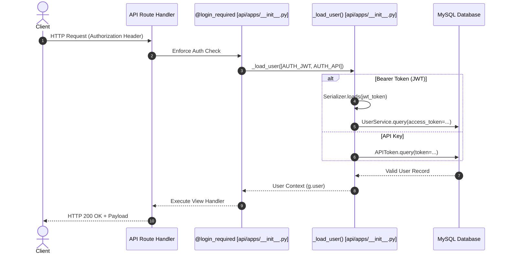

# Authentication Security & Tokens

## Level 1: Conceptual Explanation

RAGFlow supports three authentication schemes:
1. **JWT Session Authentication (`AUTH_JWT`)**: Short-lived access tokens generated upon email/password login, passed in the `Authorization: Bearer <jwt>` HTTP header or session cookie.
2. **API Keys (`AUTH_API`)**: Persistent developer API tokens (`ragflow-xxxx...`) mapped to specific tenant accounts for programmatic REST integrations.
3. **Beta Tokens (`AUTH_BETA`)**: Legacy/beta integration tokens.

---

## Level 2: Implementation Details

### Token Validation Logic: `_load_user()`

Located in [`api/apps/__init__.py#L144-L230`](file:///home/logan78/Desktop/ragflow/api/apps/__init__.py#L144-L230):

```python
def _load_user(auth_types=None):
    # 1. Check if user already loaded in quart request context (g.user)
    # 2. Extract Authorization header or session cookie
    authorization = request.headers.get("Authorization")
    if authorization[:7].lower() == "bearer ":
        auth_token = authorization.split(maxsplit=1)[1]
    else:
        auth_token = authorization

    # 3. Try Beta Token verification
    if AUTH_BETA in auth_types:
        objs = APIToken.query(beta=auth_token)
        if objs:
            user = UserService.query(id=objs[0].tenant_id, status=StatusEnum.VALID.value)
            if user:
                return user[0]

    # 4. Try JWT decoding
    if AUTH_JWT in auth_types:
        jwt = Serializer(secret_key=settings.get_secret_key())
        access_token = str(jwt.loads(auth_token))
        user = UserService.query(access_token=access_token, status=StatusEnum.VALID.value)
        if user:
            return user[0]

    # 5. Try API Token verification
    if AUTH_API in auth_types:
        objs = APIToken.query(token=auth_token)
        if objs:
            user = UserService.query(id=objs[0].tenant_id, status=StatusEnum.VALID.value)
            if user:
                return user[0]

    return None
```

### Authentication Protection Decorator: `@login_required`

Defined in [`api/apps/__init__.py#L235-L280`](file:///home/logan78/Desktop/ragflow/api/apps/__init__.py#L235-L280):
- Intercepts incoming HTTP requests.
- Invokes `_load_user(auth_types)`.
- If invalid or expired, raises `QuartAuthUnauthorized` exception (HTTP 401 response).

---

## Authentication Flow



---

## References & Source Links

- [`api/apps/__init__.py:L144-L230`](file:///home/logan78/Desktop/ragflow/api/apps/__init__.py#L144-L230) - Token extraction and authentication loading.
- [`api/apps/__init__.py:L235-L280`](file:///home/logan78/Desktop/ragflow/api/apps/__init__.py#L235-L280) - `@login_required` decorator.
