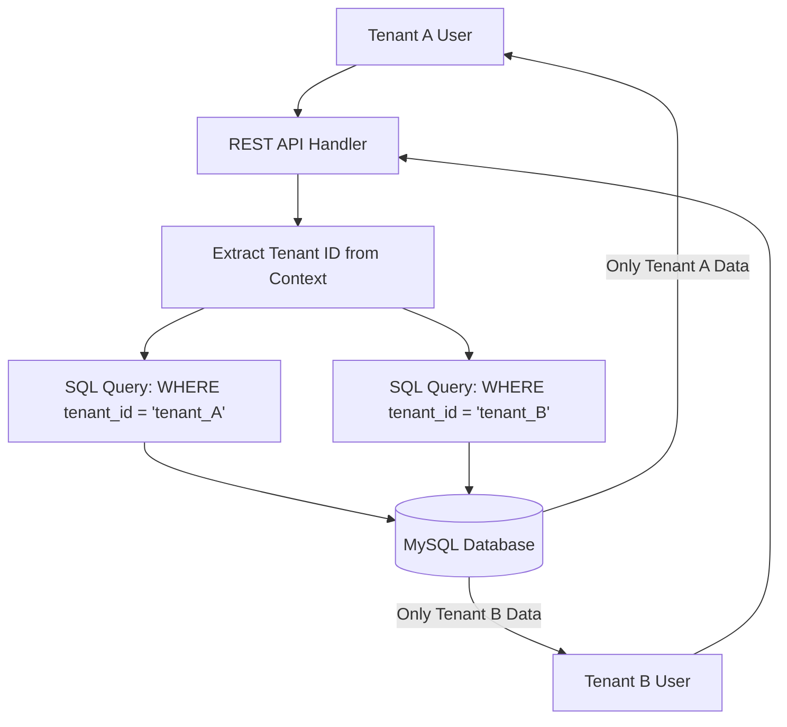

# Authorization Security & RBAC Multi-Tenancy Isolation

## Level 1: Conceptual Explanation

Authorization in RAGFlow enforces multi-tenant workspace isolation and role-based access control (RBAC). Every dataset, document, document chunk, chat agent, and workflow task is bound to a single `tenant_id`. Cross-tenant data leakage is prevented at the database service layer by explicitly appending `tenant_id = current_user.tenant_id` to every query filter.

---

## Level 2: Implementation Details

### Multi-Tenancy Isolation Mechanism

1. **User Tenant Binding**: Upon authentication (`_load_user()`), `g.user.id` or `g.user.tenant_id` is loaded into thread-local/request-local context.
2. **Mandatory Query Filtering**: Service classes (e.g. `KnowledgebaseService`, `DocumentService`, `TaskService`) require `tenant_id` in search conditions:
   ```python
   # Example: api/db/services/knowledgebase_service.py
   kb = KnowledgebaseService.query(id=kb_id, tenant_id=current_user.tenant_id)
   if not kb:
       raise PermissionError("Access denied or dataset does not exist")
   ```

---

### RBAC System & Role Management

Defined in CLI Admin Mode ([`internal/cli/admin_command.go`](file:///home/logan78/Desktop/ragflow/internal/cli/admin_command.go#L100-L300)) and API server RBAC tables:
- **`CREATE ROLE <name> DESCRIPTION '<desc>'`**: Instantiates custom enterprise security roles.
- **`GRANT <permission> ON <resource> TO ROLE <role_name>`**: Assigns granular read/write/admin permissions over datasets, agents, or system services.
- **`REVOKE <permission> ON <resource> FROM ROLE <role_name>`**: Revokes assigned privileges.

---

## Multi-Tenant Access Isolation Flow



---

## References & Source Links

- [`internal/cli/admin_command.go:L100-L300`](file:///home/logan78/Desktop/ragflow/internal/cli/admin_command.go#L100-L300) - CLI Role and Permission management commands.
- [`api/apps/__init__.py:L235-L280`](file:///home/logan78/Desktop/ragflow/api/apps/__init__.py#L235-L280) - Auth context initialization.
