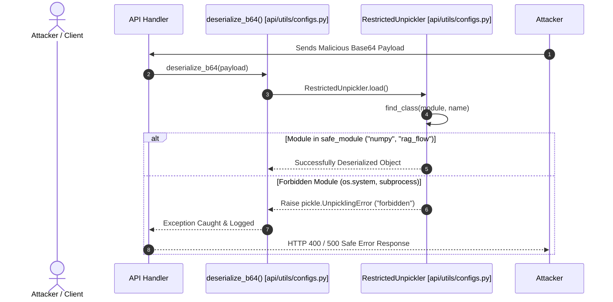

# File Security & Unpickling Safety

## Level 1: Conceptual Explanation

File security in RAGFlow protects against three critical attack vectors:
1. **Unpickling Remote Code Execution (RCE)**: Deserializing untrusted Python pickle objects can lead to arbitrary code execution. RAGFlow implements a strict custom unpickler (`RestrictedUnpickler`) to eliminate deserialization exploits.
2. **File Upload & Path Traversal Safeguards**: Uploaded document files are validated, extension-checked, sanitized, and stored under randomized UUID object names in MinIO/S3 to prevent directory traversal (`../`) attacks.
3. **LLM Code Execution Sandboxing**: LLM-generated code snippets are executed inside isolated Docker container pools managed by `sandbox-executor-manager` under non-root user privileges, memory limits, and optional Seccomp filters.

---

## Level 2: Implementation Details

### 1. Unpickling Protection (`api/utils/configs.py`)

As reported in [`SECURITY.md`](file:///home/logan78/Desktop/ragflow/SECURITY.md#L1-L75), standard `pickle.loads()` poses severe security risks if arbitrary modules (e.g. `subprocess`, `os`, `numpy.f2py.diagnose.run_command`) can be instantiated during unpickling.

RAGFlow remedies this by overriding `pickle.Unpickler.find_class()` in [`api/utils/configs.py#L22-L52`](file:///home/logan78/Desktop/ragflow/api/utils/configs.py#L22-L52):

```python
safe_module = {"numpy", "rag_flow"}

class RestrictedUnpickler(pickle.Unpickler):
    def find_class(self, module, name):
        import importlib

        if module.split(".")[0] in safe_module:
            _module = importlib.import_module(module)
            return getattr(_module, name)
        # Forbid everything else.
        raise pickle.UnpicklingError("global '%s.%s' is forbidden" % (module, name))

def restricted_loads(src):
    """Helper function analogous to pickle.loads()."""
    return RestrictedUnpickler(io.BytesIO(src)).load()

def deserialize_b64(src):
    src = base64.b64decode(string_to_bytes(src) if isinstance(src, str) else src)
    return restricted_loads(src)
```

---

### 2. Code Execution Sandbox Isolation

Configured in [`docker/docker-compose-base.yml#L179-L206`](file:///home/logan78/Desktop/ragflow/docker/docker-compose-base.yml#L179-L206):
- Spawns pre-warmed sandbox containers (`infiniflow/sandbox-base-python` and `infiniflow/sandbox-base-nodejs`).
- **Security Constraints**:
  - `SANDBOX_MAX_MEMORY=256m`
  - `SANDBOX_TIMEOUT=10s`
  - `security_opt: ["no-new-privileges:true"]`
  - Disabled network access unless explicitly routed.

---

## Unpickling Safety Flow Diagram



---

## References & Source Links

- [`api/utils/configs.py:L22-L52`](file:///home/logan78/Desktop/ragflow/api/utils/configs.py#L22-L52) - `RestrictedUnpickler` implementation.
- [`SECURITY.md:L1-L75`](file:///home/logan78/Desktop/ragflow/SECURITY.md#L1-L75) - Official security policy advisory.
- [`docker/docker-compose-base.yml:L179-L206`](file:///home/logan78/Desktop/ragflow/docker/docker-compose-base.yml#L179-L206) - Sandbox security configuration.
