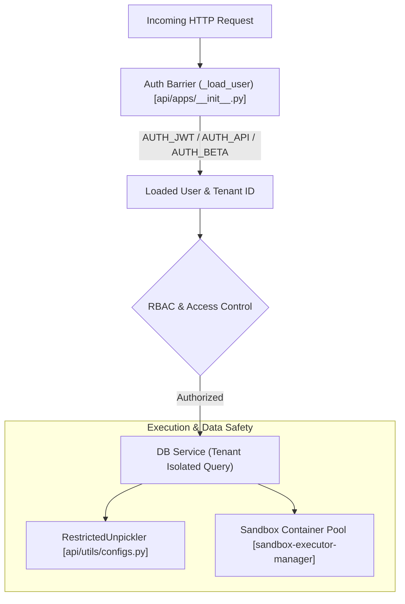

# Security Overview

## Level 1: Conceptual Explanation

RAGFlow implements defense-in-depth security principles across API transport, user authentication, multi-tenant workspace isolation, access control (RBAC), code execution sandboxing, secrets management, and safe object deserialization (unpickling protection).

### Key Security Layers
1. **Authentication & Identity**: Dual-mechanism auth supporting JWT session tokens, persistent API Keys (`ragflow-xxxx`), and OAuth2 SSO integrations.
2. **Multi-Tenancy Isolation**: Database query filtering strictly scoping datasets, documents, chat histories, and tasks by `tenant_id`.
3. **Unpickling Protection**: Restricted unpickler (`RestrictedUnpickler`) enforcing strict class whitelisting (`safe_module = {"numpy", "rag_flow"}`) to neutralize arbitrary code execution exploits via pickle payloads.
4. **Code Execution Sandboxing**: `sandbox-executor-manager` running isolated, resource-capped container pools with Seccomp syscall filtering for LLM-generated code.
5. **Secret Management**: Sensitive database passwords and API keys loaded from environment variables and secret stores, masked in API responses.

---

## Level 2: Implementation Details

### Security Subsystem Map

```
api/
├── apps/__init__.py                # Auth decorators (@login_required), token extraction (_load_user)
├── utils/
│   ├── configs.py                  # RestrictedUnpickler & restricted_loads implementation
│   └── api_utils.py                # Secret key hashing & token generation
└── db/services/                    # Multi-tenant data access services (tenant_id filtering)

internal/cli/
├── crypt.go                        # Passwords & API Key cryptographic utilities
└── http_client.go                  # Auth header injection & TLS client transport

agent/sandbox/
└── executor_manager/               # Containerized sandbox environment manager
```

---

## Security Layer Architecture



---

## References & Source Links

- [`api/apps/__init__.py:L144-L280`](file:///home/logan78/Desktop/ragflow/api/apps/__init__.py#L144-L280) - Core authentication enforcement.
- [`api/utils/configs.py:L22-L52`](file:///home/logan78/Desktop/ragflow/api/utils/configs.py#L22-L52) - Unpickling security protection (`RestrictedUnpickler`).
- [`SECURITY.md:L1-L75`](file:///home/logan78/Desktop/ragflow/SECURITY.md#L1-L75) - Official vulnerability reporting policy and unpickling vulnerability documentation.
