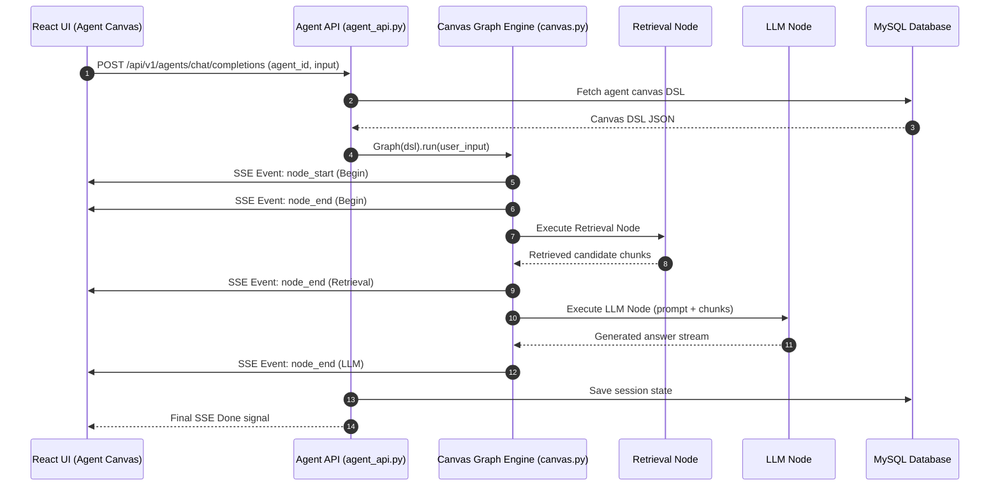

# End-to-End Agent Execution Flow

## Level 1: Conceptual Overview

RAGFlow features a drag-and-drop Agent Canvas that enables users to design, debug, and run multi-step autonomous AI agents and complex RAG workflows. Agent Canvas models workflow logic as a Directed Acyclic Graph (DAG) of specialized components (Begin, Retrieval, Categorize, LLM, Code, Switch, ExeSQL, Generate, Iteration, Answer).

### Execution Principles
1. **DAG Topology Resolution**: When an agent request arrives, the engine loads the agent DSL (`canvas_type` schema), parses nodes and directed edges, and computes dependency ordering.
2. **Asynchronous Component Execution**: Execution starts at the `Begin` component and flows downstream. Each component receives inputs from upstream component outputs, executes domain-specific logic, and passes results forward.
3. **Real-time SSE Event Emission**: Node execution states (`component_start`, `component_end`, intermediate token streams, errors) are streamed back to the client via Server-Sent Events.

---

## Level 2: Technical Implementation Details

### API Endpoint & Routing
- **Python Route**: `POST /api/v1/agents/chat/completions` or `POST /api/v1/agents/chat/completions` handled by `agent_chat_completion()` in [api/apps/restful_apis/agent_api.py:L1447](file:///home/logan78/Desktop/ragflow/api/apps/restful_apis/agent_api.py#L1447).
- **Go Engine**: `Canvas.Run()` in [internal/agent/canvas/canvas.go:L80](file:///home/logan78/Desktop/ragflow/internal/agent/canvas/canvas.go#L80).

### Code Call Chain
```
[React UI Agent Canvas / Chat Input]
       │
       ▼ (HTTP POST /api/v1/agents/chat/completions)
[api/apps/restful_apis/agent_api.py:agent_chat_completion()]
       │
       ├─► Fetch Agent Canvas DSL from MySQL table `canvas`
       ├─► Instantiate Graph Engine: agent/canvas.py:Graph(canvas_dsl)
       │
       ▼
[agent/canvas.py:Graph.run()]
       │
       ├─► 1. Execute Begin Component: Read user input & query parameters
       ├─► 2. Resolve Downstream Nodes: Component queues downstream neighbors
       ├─► 3. Execute Retrieval Component: Perform hybrid search on selected KBs
       ├─► 4. Execute Categorize / Switch Component: Conditional path routing
       ├─► 5. Execute LLM Component: Synthesize answer with LLMBundle
       └─► 6. Execute Answer / End Component: Finalize response
       │
       ▼
[SSE Event Stream to Client] -> Streams node-by-node execution updates & final text
```

### Source Code References
- **Agent REST Handler**: `agent_chat_completion()` in [api/apps/restful_apis/agent_api.py:L1447](file:///home/logan78/Desktop/ragflow/api/apps/restful_apis/agent_api.py#L1447)
- **Canvas Graph Engine**: `Graph` class in [agent/canvas.py:L49](file:///home/logan78/Desktop/ragflow/agent/canvas.py#L49)
- **Graph Execution Method**: `Graph.run()` in [agent/canvas.py:L440](file:///home/logan78/Desktop/ragflow/agent/canvas.py#L440)
- **Base Component Class**: `ComponentBase` in [agent/component/base.py:L30](file:///home/logan78/Desktop/ragflow/agent/component/base.py#L30)
- **LLM Component**: [agent/component/llm.py:L40](file:///home/logan78/Desktop/ragflow/agent/component/llm.py#L40)
- **Go Canvas Engine**: [internal/agent/canvas/canvas.go:L80](file:///home/logan78/Desktop/ragflow/internal/agent/canvas/canvas.go#L80)

---

## Sequence Diagram


