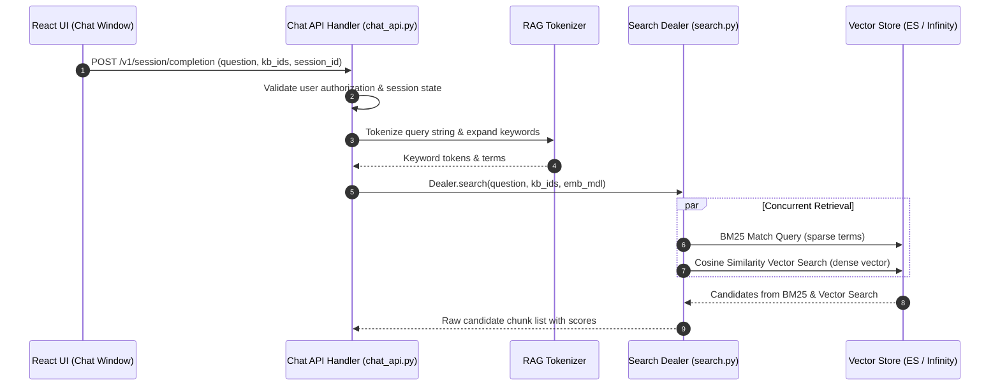

# End-to-End Ask Question Flow

## Level 1: Conceptual Overview

The Ask Question flow is the entry point for retrieval-augmented question answering. When a user submits a prompt via the Chat UI or Search bar, the system processes the raw input string, authenticates the active session and Knowledge Base access permissions, tokenizes the prompt, and initiates hybrid retrieval against the target vector stores.

### Core Steps
1. **Query Ingestion**: Receive HTTP POST with user prompt text, session ID, and list of target Knowledge Base IDs.
2. **Session Verification**: Ensure active conversation/dialog ownership and retrieve tenant configuration.
3. **Query Tokenization & Preprocessing**: Analyze text using `rag_tokenizer` to generate keyword terms, synonym expansions, and dense query embeddings.
4. **Hybrid Search Execution**: Execute concurrent BM25 term search and vector cosine similarity search in Elasticsearch or Infinity via `Dealer.search()`.

---

## Level 2: Technical Implementation Details

### API Endpoint & Routing
- **Python Route**: `POST /v1/session/completion` handled by `session_completion()` in [api/apps/restful_apis/chat_api.py:L1230](file:///home/logan78/Desktop/ragflow/api/apps/restful_apis/chat_api.py#L1230).
- **Go Route**: `POST /api/v1/chats/:id/completions` handled by `Completion()` in [internal/handler/chat.go:L110](file:///home/logan78/Desktop/ragflow/internal/handler/chat.go#L110).

### Code Call Chain
```
[React UI Chat Panel]
       │
       ▼ (HTTP POST /v1/session/completion)
[api/apps/restful_apis/chat_api.py:session_completion()]  or  [internal/handler/chat.go:Completion()]
       │
       ├─► Verify session ID & tenant ownership
       ├─► Extract query text & candidate kb_ids
       ├─► Tokenize query: rag/nlp/rag_tokenizer.py:tokenize()
       ├─► Compute query embedding: LLMBundle.encode_queries(query_text)
       ├─► Execute Search Engine:
       │     └─► rag/nlp/search.py:Dealer.search(req, idx_names, kb_ids, emb_mdl)
       │           ├─► Sparse BM25 Keyword Search
       │           └─► Dense Cosine Vector Similarity Search
       │
       ▼ Next Stage: Reranking & Prompt Generation (RAG Answer)
```

### Source Code References
- **Chat REST Handler**: `session_completion()` in [api/apps/restful_apis/chat_api.py:L1230](file:///home/logan78/Desktop/ragflow/api/apps/restful_apis/chat_api.py#L1230)
- **Go Chat Handler**: `Completion()` in [internal/handler/chat.go:L110](file:///home/logan78/Desktop/ragflow/internal/handler/chat.go#L110)
- **Search Engine Dealer**: `Dealer.search()` in [rag/nlp/search.py:L134](file:///home/logan78/Desktop/ragflow/rag/nlp/search.py#L134)
- **RAG Tokenizer**: [rag/nlp/rag_tokenizer.py:L35](file:///home/logan78/Desktop/ragflow/rag/nlp/rag_tokenizer.py#L35)
- **Query Engine**: [rag/nlp/query.py:L40](file:///home/logan78/Desktop/ragflow/rag/nlp/query.py#L40)

---

## Sequence Diagram


