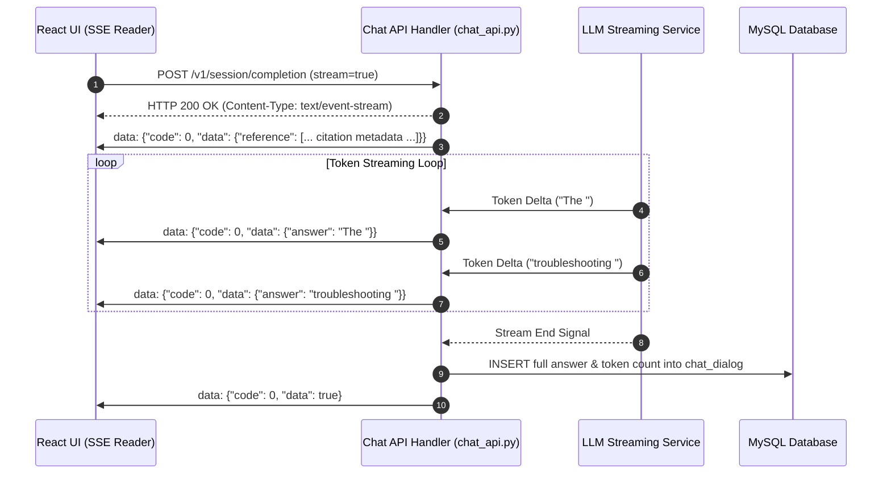

# End-to-End Chat Streaming Flow (SSE)

## Level 1: Conceptual Overview

Chat streaming in RAGFlow provides real-time, low-latency visual feedback by delivering generated response tokens to the frontend as soon as they are produced by the Large Language Model.

### Core Architectural Features
1. **Server-Sent Events (SSE) Protocol**: HTTP connection remains open with `Content-Type: text/event-stream` and `Cache-Control: no-cache`.
2. **Chunked Token Delivery**: Response chunks are formatted into JSON data frames (`data: {...}\n\n`) and yielded incrementally.
3. **Reference Payload Injection**: Citation references, document preview thumbnails, and vector match metadata are sent alongside initial text frames so the React frontend can render interactive citation links in real time.
4. **Final Sync & Persistence**: When the LLM yields the final token stream payload (`data: true` or complete JSON), the entire message is saved to MySQL.

---

## Level 2: Technical Implementation Details

### API Endpoint & Routing
- **Python Route & Generator**: `session_completion()` in [api/apps/restful_apis/chat_api.py:L1230](file:///home/logan78/Desktop/ragflow/api/apps/restful_apis/chat_api.py#L1230) using inner async generator `stream()` [L1328].
- **Go Route & SSE Flush**: `Completion()` in [internal/handler/chat.go:L110](file:///home/logan78/Desktop/ragflow/internal/handler/chat.go#L110).

### Code Call Chain
```
[React UI Chat View]
       │
       ▼ (HTTP POST /v1/session/completion with stream=true)
[api/apps/restful_apis/chat_api.py:session_completion()]
       │
       ├─► Initialize response headers: Content-Type: text/event-stream
       ├─► Execute Hybrid Search & Reranking -> Obtain top chunks & citations
       ├─► Send initial SSE frame containing retrieved chunk metadata (`reference`)
       │
       ▼
[api/db/services/llm_service.py:LLMBundle.chat_streamly()]
       │
       ├─► Yield LLM stream chunks asynchronously: for delta in llm.chat_streamly(...)
       ├─► Format JSON frame: f"data: {json.dumps({'code': 0, 'data': {'answer': delta}})}\n\n"
       ├─► Flush frame to socket: stream_with_context()
       │
       ▼
[React UI fetch / EventSource reader] -> Renders typing effect & interactive citations
       │
       ▼ (Stream Complete)
[api/db/services/dialog_service.py] -> Persist complete text to MySQL `chat_session`
```

### Source Code References
- **Python SSE Generator**: `stream()` in [api/apps/restful_apis/chat_api.py:L1328](file:///home/logan78/Desktop/ragflow/api/apps/restful_apis/chat_api.py#L1328)
- **LLM Streaming Service**: `LLMBundle.chat_streamly()` in [api/db/services/llm_service.py:L220](file:///home/logan78/Desktop/ragflow/api/db/services/llm_service.py#L220)
- **Go SSE Stream Handler**: `Completion()` in [internal/handler/chat.go:L150](file:///home/logan78/Desktop/ragflow/internal/handler/chat.go#L150)
- **Frontend SSE Hook/Component**: [web/src/pages/next-chats/chat/index.tsx](file:///home/logan78/Desktop/ragflow/web/src/routes.tsx#L192)

---

## Sequence Diagram


