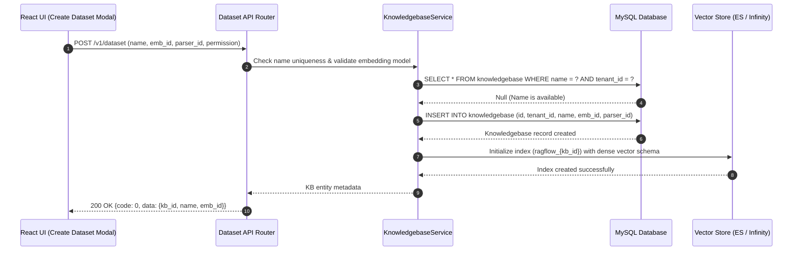

# End-to-End Create Knowledge Base Flow

## Level 1: Conceptual Overview

Creating a Knowledge Base (referred to as a **Dataset** in API endpoints and UI) is the core prerequisite for document ingestion and retrieval in RAGFlow. A Knowledge Base encapsulates:
1. **Embedding Model Selection**: Specifies the dense vector embedding model (e.g. `BAAI/bge-large-zh-v1.5`, `text-embedding-3-small`, `qwen-embedding`) used to convert text chunks into vector representations.
2. **Parsing Strategy / Chunking Engine**: Default chunking method (`naive`, `qa`, `resume`, `manual`, `paper`, `laws`, `table`, `book`, `presentation`, `picture`).
3. **Vector Index Provisioning**: Physical index creation within Elasticsearch or InfiniFlow Infinity engine (`ragflow_{dataset_id}`) configured with matching vector dimension size, analyzer, and field schemas.

---

## Level 2: Technical Implementation Details

### API Endpoint & Routing
- **Python Route**: `POST /v1/dataset/create` or `POST /v1/dataset` handled by `create()` in [api/apps/restful_apis/dataset_api.py:L86](file:///home/logan78/Desktop/ragflow/api/apps/restful_apis/dataset_api.py#L86).
- **Go Route**: `POST /api/v1/datasets` handled by `Create()` in [internal/handler/dataset.go:L50](file:///home/logan78/Desktop/ragflow/internal/handler/dataset.go#L50).

### Code Call Chain
```
[React UI Create KB Modal]
       │
       ▼ (HTTP POST /v1/dataset)
[api/apps/restful_apis/dataset_api.py:create()]  or  [internal/handler/dataset.go:Create()]
       │
       ├─► Check duplicate dataset name for tenant
       ├─► Resolve Embedding Model ID & dimension size via TenantModelService
       ├─► KnowledgebaseService.save() -> INSERT INTO `knowledgebase` table in MySQL
       ├─► Create Vector Index:
       │     ├─► Elasticsearch: ESConnection.create_index(index_name=f"ragflow_{kb_id}")
       │     └─► Infinity: InfinityConnection.create_table(index_name=f"ragflow_{kb_id}")
       └─► Return KB JSON object
       │
       ▼
[HTTP 200 OK Response] -> {code: 0, data: {id: "kb_id", name: "...", emb_id: "..."}}
```

### Source Code References
- **Python Handler**: `create()` in [api/apps/restful_apis/dataset_api.py:L86](file:///home/logan78/Desktop/ragflow/api/apps/restful_apis/dataset_api.py#L86)
- **Python KB Service**: `KnowledgebaseService` in [api/db/services/knowledgebase_service.py:L35](file:///home/logan78/Desktop/ragflow/api/db/services/knowledgebase_service.py#L35)
- **Go Handler**: `Create()` in [internal/handler/dataset.go:L50](file:///home/logan78/Desktop/ragflow/internal/handler/dataset.go#L50)
- **Go Dataset Service**: `Create()` in [internal/service/dataset.go:L60](file:///home/logan78/Desktop/ragflow/internal/service/dataset.go#L60)
- **Vector Index Creator (ES)**: `create_idx()` in [rag/utils/es_conn.py:L110](file:///home/logan78/Desktop/ragflow/rag/utils/es_conn.py#L110)
- **Vector Index Creator (Infinity)**: `create_table()` in [rag/utils/infinity_conn.py:L80](file:///home/logan78/Desktop/ragflow/rag/utils/infinity_conn.py#L80)

---

## Sequence Diagram


