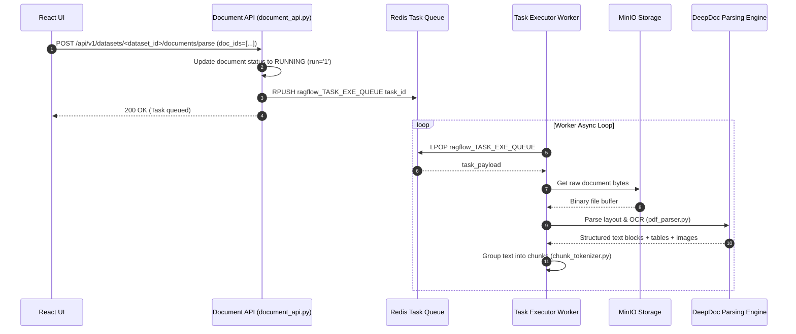

# End-to-End Document Processing Flow

## Level 1: Conceptual Overview

Document processing transforms raw documents (PDF, DOCX, XLSX, Images, etc.) into structured, chunked text units ready for vector embedding and retrieval. When a user clicks "Parse" in the UI, RAGFlow initiates an asynchronous parsing pipeline:
1. **Task Scheduling**: A processing task is created in MySQL table `task` and enqueued into Redis task queue `ragflow_TASK_EXE_QUEUE`.
2. **Task Execution**: A background worker process (`rag/svr/task_executor.py`) pops tasks from Redis.
3. **DeepDoc Parser Execution**: Depending on document type and knowledge base `parser_id`, DeepDoc applies vision-based layout analysis (YOLOv10 / PP-YOLO), OCR text recognition (PaddleOCR), table structure reconstruction, and figure extraction.

---

## Level 2: Technical Implementation Details

### API Endpoint & Routing
- **Python Route**: `POST /api/v1/datasets/<dataset_id>/documents/parse` handled by `parse_documents()` in [api/apps/restful_apis/document_api.py:L1552](file:///home/logan78/Desktop/ragflow/api/apps/restful_apis/document_api.py#L1552).
- **Go Route**: `POST /api/v1/datasets/:id/documents/run` handled by `Run()` in [internal/handler/document.go:L180](file:///home/logan78/Desktop/ragflow/internal/handler/document.go#L180).

### Code Call Chain
```
[React UI Parse Button Click]
       │
       ▼ (HTTP POST /api/v1/datasets/<dataset_id>/documents/parse)
[api/apps/restful_apis/document_api.py:parse_documents()]
       │
       ├─► Update MySQL `document` status: run = '1' (RUNNING), progress = 0.0
       ├─► TaskService.create_task() -> INSERT INTO `task`
       └─► REDIS_CONN.queue_product("ragflow_TASK_EXE_QUEUE", task_payload)
       │
       ▼ (Asynchronous Redis Task Queue)
[rag/svr/task_executor.py:main()] Worker Loop
       │
       ├─► Pop task payload from Redis queue
       ├─► Fetch binary file blob from MinIO via FileService.get_file()
       ├─► Select Parser Engine:
       │     ├─► ParserType.PRESENTATION / PDF: DeepDoc PdfParser (layout analysis + OCR)
       │     ├─► ParserType.LAWS / MANUAL / NAIVE: ChunkTokenizer & Markdown splitter
       │     ├─► ParserType.PAPER / QA: DeepDoc QA / Paper parser
       │     └─► ParserType.TABLE: DeepDoc Excel / Table parser
       ├─► Extract text blocks, tables, bounding boxes, images
       └─► Generate Chunk Objects with metadata (page_num, position, image_id)
       │
       ▼ Next Stage: Indexing Pipeline
```

### Source Code References
- **Python Route Handler**: `parse_documents()` in [api/apps/restful_apis/document_api.py:L1552](file:///home/logan78/Desktop/ragflow/api/apps/restful_apis/document_api.py#L1552)
- **Task Dispatcher**: `TaskService` in [api/db/services/task_service.py:L40](file:///home/logan78/Desktop/ragflow/api/db/services/task_service.py#L40)
- **Worker Main Loop**: `main()` in [rag/svr/task_executor.py:L1904](file:///home/logan78/Desktop/ragflow/rag/svr/task_executor.py#L1904)
- **DeepDoc PDF Parser**: [deepdoc/parser/pdf_parser.py:L50](file:///home/logan78/Desktop/ragflow/deepdoc/parser/pdf_parser.py#L50)
- **DeepDoc Vision Layout**: [deepdoc/vision/layout_recognizer.py:L30](file:///home/logan78/Desktop/ragflow/deepdoc/vision/layout_recognizer.py#L30)

---

## Sequence Diagram


