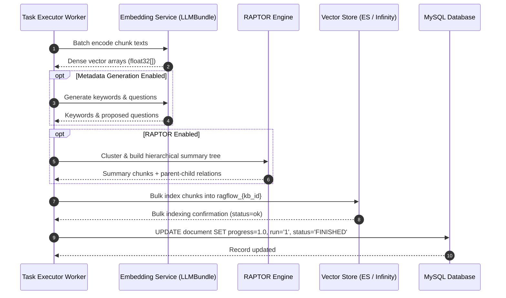

# End-to-End Indexing Flow

## Level 1: Conceptual Overview

The indexing flow takes raw text chunks produced during document parsing and transforms them into searchable vector indices and metadata-enriched document stores. 

### Key Processing Stages
1. **Vector Embedding Generation**: Dense vector representation computed for each chunk text using the tenant's chosen embedding model via `LLMBundle.encode()`.
2. **Metadata & Prompt Enrichment**: Optional background LLM passes extract high-level metadata:
   - Keyword extraction (`keyword_extraction`)
   - Anti-hallucination question proposal (`question_proposal`)
   - Content tagging (`content_tagging`)
3. **RAPTOR Hierarchical Summarization**: If RAPTOR is enabled on the Knowledge Base, small chunks are recursively clustered (GMM / K-Means) and summarized using an LLM to build a hierarchical summary tree.
4. **Vector Store Ingestion**: Chunks are bulk-inserted into Elasticsearch or Infinity vector indices (`ragflow_{kb_id}`) containing both dense vector fields (`q_{dim}_vec`) and sparse keyword BM25 fields (`content_ltks`, `title_tks`).
5. **Database Completion**: Document parsing state is set to `FINISHED` (`run = '1'`, `progress = 1.0`) in MySQL table `document`.

---

## Level 2: Technical Implementation Details

### Primary Code Call Chain
```
[Worker Task Executor] (task_executor.py)
       │
       ├─► Generate Dense Embeddings: LLMBundle.encode(chunks)
       │     └─► api/db/services/llm_service.py:LLMBundle.encode()
       │
       ├─► (Optional) Enrich Chunks:
       │     ├─► rag/prompts/generator.py:keyword_extraction()
       │     └─► rag/prompts/generator.py:question_proposal()
       │
       ├─► (Optional) Build RAPTOR Tree:
       │     └─► rag/utils/raptor_utils.py:RAPTOR_TREE_BUILDER()
       │
       ├─► Bulk Insert to Vector Store:
       │     ├─► Elasticsearch: ESConnection.insert_chunks(chunks, index_name)
       │     │     └─► rag/utils/es_conn.py:insert_chunks()
       │     └─► Infinity: InfinityConnection.insert(chunks, index_name)
       │           └─► rag/utils/infinity_conn.py:insert()
       │
       └─► Update MySQL Status:
             └─► DocumentService.update_by_id(doc_id, {"progress": 1.0, "run": "1", "status": "FINISHED"})
       │
       ▼
[Indexing Complete & Live in Search Index]
```

### Source Code References
- **LLM Embedding Bundle**: `LLMBundle.encode()` in [api/db/services/llm_service.py:L120](file:///home/logan78/Desktop/ragflow/api/db/services/llm_service.py#L120)
- **RAPTOR Tree Builder**: `RAPTOR_TREE_BUILDER` in [rag/utils/raptor_utils.py:L48](file:///home/logan78/Desktop/ragflow/rag/utils/raptor_utils.py#L48)
- **Metadata Generator Prompts**: `keyword_extraction()`, `question_proposal()` in [rag/prompts/generator.py:L59](file:///home/logan78/Desktop/ragflow/rag/prompts/generator.py#L59)
- **Elasticsearch Ingest**: `insert_chunks()` in [rag/utils/es_conn.py:L150](file:///home/logan78/Desktop/ragflow/rag/utils/es_conn.py#L150)
- **Infinity Ingest**: `insert()` in [rag/utils/infinity_conn.py:L120](file:///home/logan78/Desktop/ragflow/rag/utils/infinity_conn.py#L120)
- **Document Progress Persistence**: [api/db/services/document_service.py:L120](file:///home/logan78/Desktop/ragflow/api/db/services/document_service.py#L120)

---

## Sequence Diagram


