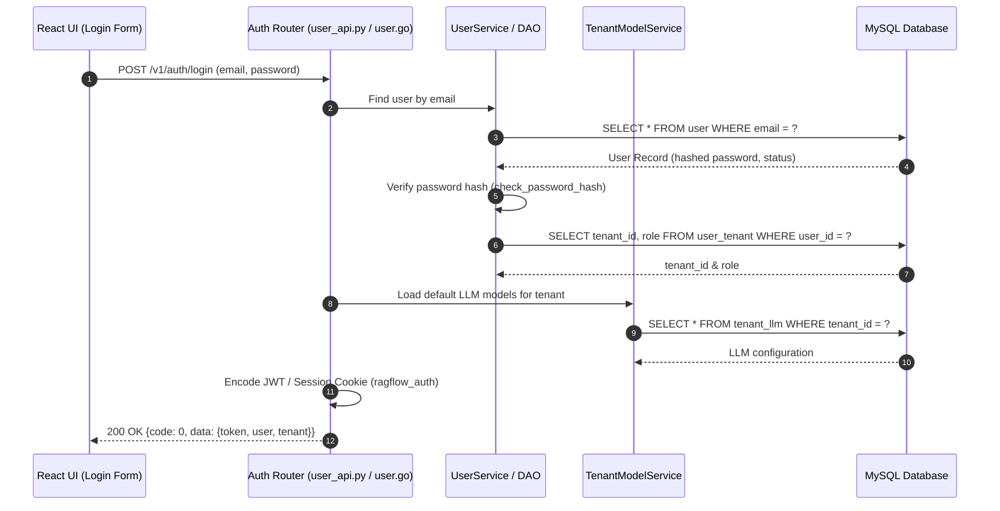

# End-to-End User Authentication & Login Flow

## Level 1: Conceptual Overview

The authentication and login flow validates user credentials, loads user workspace metadata, initializes LLM model defaults for the user's active tenant, and issues a signed authentication token or session cookie (`ragflow_auth`). 

### Supported Authentication Channels
1. **Password Authentication**: Standard email and hashed password verification.
2. **OAuth / OIDC Channels**: External authorization via GitHub (`api/apps/auth/github.py`) or OIDC (`api/apps/auth/oidc.py`).
3. **Session & Tenant Setup**: Upon successful authentication, the system queries the active `tenant_id`, populates `current_user` in the session context, and retrieves default LLM configurations (Embedding, Chat LLM, Rerank) associated with the user's tenant.

---

## Level 2: Technical Implementation Details

### API Endpoint & Routing
- **Python Route**: `POST /v1/auth/login` handled by `login()` in [api/apps/restful_apis/user_api.py:L61](file:///home/logan78/Desktop/ragflow/api/apps/restful_apis/user_api.py#L61).
- **Go Route**: `POST /api/v1/auth/login` handled by `Login()` in [internal/handler/user.go:L120](file:///home/logan78/Desktop/ragflow/internal/handler/user.go#L120).

### Code Call Chain
```
[React UI Login Form]
       │
       ▼ (HTTP POST /v1/auth/login)
[api/apps/restful_apis/user_api.py:login()]  or  [internal/handler/user.go:Login()]
       │
       ├─► UserService.query(email=email) / userDAO.FindByEmail()
       ├─► Password Verification: check_password_hash(user.password, input_password)
       ├─► UserTenantService: Fetch tenant_id and role ('owner', 'admin', 'normal')
       ├─► TenantModelService: load default LLMs via get_tenant_default_model_by_type()
       └─► Token/Session Generation: set_cookie('ragflow_auth', token)
       │
       ▼
[HTTP 200 OK Response] -> {code: 0, data: {access_token, user_info, tenant_info}}
```

### Source Code References
- **Python Auth Handler**: `login()` in [api/apps/restful_apis/user_api.py:L61](file:///home/logan78/Desktop/ragflow/api/apps/restful_apis/user_api.py#L61)
- **Go Auth Handler**: `Login()` in [internal/handler/user.go:L120](file:///home/logan78/Desktop/ragflow/internal/handler/user.go#L120)
- **Go UserService**: `Login()` in [internal/service/user.go:L359](file:///home/logan78/Desktop/ragflow/internal/service/user.go#L359)
- **Tenant Model Config**: [api/db/joint_services/tenant_model_service.py](file:///home/logan78/Desktop/ragflow/api/db/joint_services/tenant_model_service.py#L30)
- **OAuth Connectors**: [api/apps/auth/github.py](file:///home/logan78/Desktop/ragflow/api/apps/auth/github.py) & [api/apps/auth/oidc.py](file:///home/logan78/Desktop/ragflow/api/apps/auth/oidc.py)

---

## Sequence Diagram


