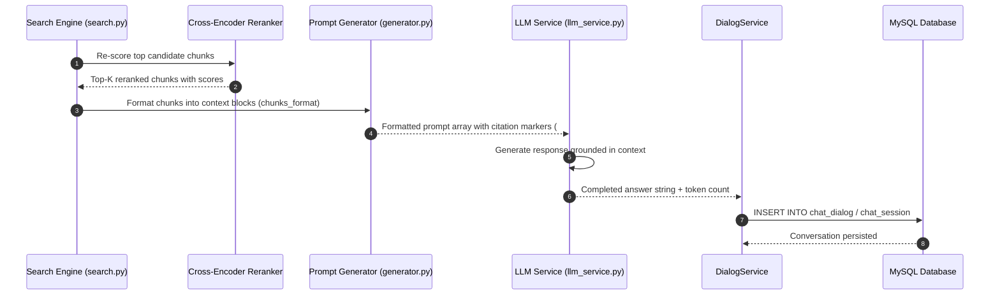

# End-to-End RAG Answer Synthesis Flow

## Level 1: Conceptual Overview

RAG Answer Synthesis is the core generation phase of Retrieval-Augmented Generation in RAGFlow. Following hybrid retrieval, candidate document chunks are processed to construct an accurate, citation-anchored context for the Large Language Model (LLM).

### Synthesis Pipeline Stages
1. **Reranking & Fusion**: Candidate chunks from hybrid search are re-scored using cross-encoder rerank models (e.g. `bge-reranker-large`, `jina-reranker-v1`) or Reciprocal Rank Fusion (RRF) to isolate top-K relevant chunks.
2. **Context Formatting**: Chunks are structured into context blocks using `chunks_format()`, decorating each chunk with citation index markers (`##0$$`, `##1$$`, etc.) referencing source document IDs and page numbers.
3. **Prompt Injection**: System prompt templates (e.g., knowledge base system rules, fallback message directives) are populated with context and conversation history.
4. **LLM Generation**: The assembled prompt array is submitted to the LLM via `LLMBundle`.
5. **Session Audit Persistence**: The generated answer, citation metadata, token counts, and latency statistics are saved to MySQL `chat_session` and `chat_dialog` tables.

---

## Level 2: Technical Implementation Details

### Primary Code Call Chain
```
[Candidate Chunks from Hybrid Search]
       │
       ▼
[rag/nlp/search.py:Dealer.rerank()]
       │
       ├─► Cross-Encoder Reranking: rerank_model.py -> Score chunks
       ├─► Apply similarity threshold & top-K cutoff
       │
       ▼
[rag/prompts/generator.py:chunks_format()]
       │
       ├─► Format text blocks with citation markers: "##0$$ Chunk text... ##0$$"
       ├─► Map citation IDs to source document metadata (doc_id, page_num, image_id)
       │
       ▼
[api/db/services/llm_service.py:LLMBundle.chat()]
       │
       ├─► Construct Chat Messages Array: [System, History..., User Context + Prompt]
       ├─► Invoke LLM API (OpenAI, Qwen, Ollama, DeepSeek, Claude, etc.)
       │
       ▼
[api/db/services/dialog_service.py:DialogService]
       │
       ├─► Persist conversation history to MySQL `chat_session` & `chat_dialog`
       └─► Record token consumption metrics in MySQL `tenant_token_usage`
       │
       ▼
[HTTP Response / Citation-Rich Payload to UI]
```

### Source Code References
- **Reranker Engine**: `rerank_model.py` and `Dealer.rerank()` in [rag/nlp/search.py:L200](file:///home/logan78/Desktop/ragflow/rag/nlp/search.py#L200)
- **Prompt Generator & Context Formatter**: `chunks_format()` in [rag/prompts/generator.py:L100](file:///home/logan78/Desktop/ragflow/rag/prompts/generator.py#L100)
- **LLM Service Invocation**: `LLMBundle.chat()` in [api/db/services/llm_service.py:L180](file:///home/logan78/Desktop/ragflow/api/db/services/llm_service.py#L180)
- **Dialog & Session Service**: `DialogService` in [api/db/services/dialog_service.py:L45](file:///home/logan78/Desktop/ragflow/api/db/services/dialog_service.py#L45)
- **Token Usage Tracking**: [common/token_utils.py:L30](file:///home/logan78/Desktop/ragflow/common/token_utils.py#L30)

---

## Sequence Diagram


