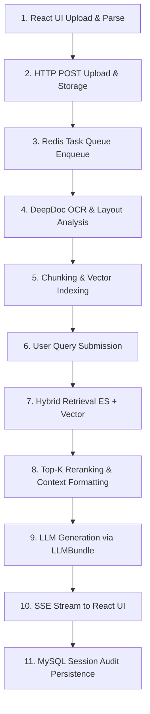

# The Ultimate Single-Story Trace: RAGFlow One Request

This document presents **The Ultimate Single-Story Trace** of RAGFlow, following a single user request from initial UI button click to chunking, vector indexing, hybrid retrieval, prompt assembly, LLM Server-Sent Events (SSE) streaming, and final database session persistence.

---

## Executive Lifecycle Overview

---

## Step 1: User Upload & Document Record Creation
- **User Action**: User uploads `technical_manual.pdf` to Knowledge Base `kb_123` via the React frontend dropzone.
- **Frontend Route**: Component in [web/src/pages/dataset/dataset/index.tsx](file:///home/logan78/Desktop/ragflow/web/src/routes.tsx#L208).
- **HTTP Request**: `POST /v1/document/upload`
- **Backend API Handler**: `upload_document()` in [api/apps/restful_apis/document_api.py:L452](file:///home/logan78/Desktop/ragflow/api/apps/restful_apis/document_api.py#L452) delegating to `_upload_local_documents()` at [L658](file:///home/logan78/Desktop/ragflow/api/apps/restful_apis/document_api.py#L658).
- **Binary Storage**: Raw PDF bytes stored in MinIO/S3 via `FileService.save_file()` in [api/db/services/file_service.py:L40](file:///home/logan78/Desktop/ragflow/api/db/services/file_service.py#L40).
- **Database Entry**: Document metadata inserted into MySQL table `document` with status `UNSTART` (`run = '0'`).

---

## Step 2: Task Dispatch & Asynchronous Parsing
- **User Action**: User clicks "Parse" in the UI.
- **HTTP Request**: `POST /v1/document/run`
- **API Handler**: `parse_documents()` in [api/apps/restful_apis/document_api.py:L1552](file:///home/logan78/Desktop/ragflow/api/apps/restful_apis/document_api.py#L1552).
- **Queue Dispatch**: Task payload pushed to Redis queue `ragflow_TASK_EXE_QUEUE` via `REDIS_CONN.queue_product()`.
- **Worker Execution**: Background process `rag/svr/task_executor.py:main()` [L1904](file:///home/logan78/Desktop/ragflow/rag/svr/task_executor.py#L1904) pops task payload.
- **DeepDoc Parsing**: Vision layout analysis and OCR executed via [deepdoc/parser/pdf_parser.py:L50](file:///home/logan78/Desktop/ragflow/deepdoc/parser/pdf_parser.py#L50).

---

## Step 3: Embedding Generation & Vector Indexing
- **Dense Vector Encoding**: Text chunks encoded into float32 vector arrays using `LLMBundle.encode()` in [api/db/services/llm_service.py:L120](file:///home/logan78/Desktop/ragflow/api/db/services/llm_service.py#L120).
- **Metadata Extraction**: Automatic keyword extraction and anti-hallucination question proposal generated via [rag/prompts/generator.py:L59](file:///home/logan78/Desktop/ragflow/rag/prompts/generator.py#L59).
- **Vector Store Ingestion**: Chunks indexed into Elasticsearch/Infinity index `ragflow_kb_123` via `insert_chunks()` in [rag/utils/es_conn.py:L150](file:///home/logan78/Desktop/ragflow/rag/utils/es_conn.py#L150).
- **DB Status Update**: Document status set to `FINISHED` (`progress = 1.0`, `run = '1'`) in MySQL.

---

## Step 4: Question Submission & Hybrid Search
- **User Prompt**: "What are the maintenance steps in Chapter 3?"
- **HTTP Request**: `POST /v1/session/completion`
- **API Handler**: `session_completion()` in [api/apps/restful_apis/chat_api.py:L1230](file:///home/logan78/Desktop/ragflow/api/apps/restful_apis/chat_api.py#L1230).
- **Query Tokenization**: Prompt tokenized using [rag/nlp/rag_tokenizer.py:L35](file:///home/logan78/Desktop/ragflow/rag/nlp/rag_tokenizer.py#L35).
- **Hybrid Retrieval**: `Dealer.search()` in [rag/nlp/search.py:L134](file:///home/logan78/Desktop/ragflow/rag/nlp/search.py#L134) executes concurrent BM25 keyword matching and vector cosine similarity search in Elasticsearch.

---

## Step 5: Top-K Reranking & Prompt Generation
- **Cross-Encoder Reranking**: `Dealer.rerank()` in [rag/nlp/search.py:L200](file:///home/logan78/Desktop/ragflow/rag/nlp/search.py#L200) re-scores candidate chunks and isolates Top-K results.
- **Context Formatting**: Chunks formatted into context blocks with citation index tags (`##0$$`, `##1$$`) via `chunks_format()` in [rag/prompts/generator.py:L100](file:///home/logan78/Desktop/ragflow/rag/prompts/generator.py#L100).
- **System Prompt Assembly**: User prompt, system rules, and formatted context merged into standard LLM message array.

---

## Step 6: Token Streaming & Conversation Audit Persistence
- **Streaming Response**: Async generator `stream()` in [api/apps/restful_apis/chat_api.py:L1328](file:///home/logan78/Desktop/ragflow/api/apps/restful_apis/chat_api.py#L1328) streams tokens chunk-by-chunk using SSE (`Content-Type: text/event-stream`).
- **UI Rendering**: React UI appends tokens in real time and renders interactive citation hover cards.
- **Database Persistence**: Conversation text, citation metadata, and token consumption metrics logged to MySQL `chat_session` and `chat_dialog` tables via [api/db/services/dialog_service.py:L45](file:///home/logan78/Desktop/ragflow/api/db/services/dialog_service.py#L45).
