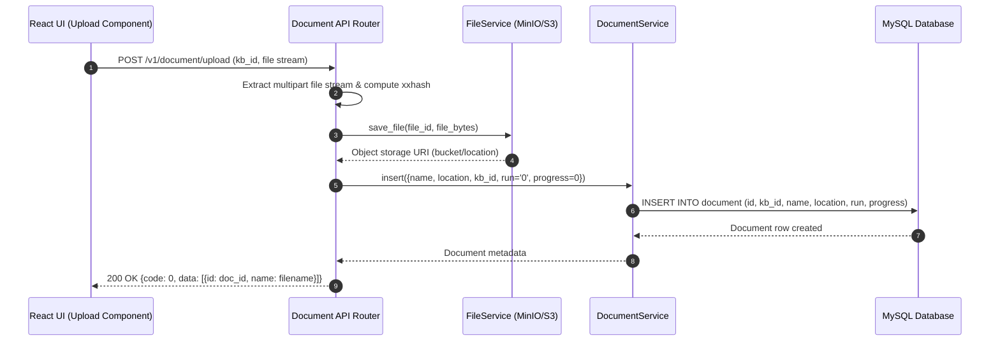

# End-to-End Upload Document Flow

## Level 1: Conceptual Overview

Document upload is the ingestion gateway in RAGFlow. Users upload raw files (PDF, DOCX, PPTX, XLSX, TXT, Markdown, JPG, PNG) into a target Knowledge Base. The upload flow performs file validation, calculates content checksums to prevent duplicate file uploads, streams raw binary blobs to object storage (MinIO, S3, or local disk), and records the document entry in MySQL with initial status `UNSTART`.

### Core Technical Objectives
1. **Multipart Data Handling**: Accept multipart form data streams from React UI dropzones or REST API clients.
2. **Binary Persistence**: Save physical files to object storage (`STORAGE_IMPL` = `minio` | `s3` | `local`) using `FileService`.
3. **Metadata Indexing**: Compute xxhash/md5 file signatures, file byte size, extension, and store document metadata in MySQL table `document`.
4. **Status Initialization**: Set initial document parsing status to `UNSTART` (`run = 0`, `progress = 0.0`) so it is queued for parsing.

---

## Level 2: Technical Implementation Details

### API Endpoint & Routing
- **Python Route**: `POST /v1/document/upload` handled by `upload_document()` in [api/apps/restful_apis/document_api.py:L452](file:///home/logan78/Desktop/ragflow/api/apps/restful_apis/document_api.py#L452).
- **Go Route**: `POST /api/v1/datasets/:id/documents/upload` handled by `Upload()` in [internal/handler/document.go:L75](file:///home/logan78/Desktop/ragflow/internal/handler/document.go#L75).

### Code Call Chain
```
[React UI File Dropzone]
       │
       ▼ (HTTP POST Multipart /v1/document/upload)
[api/apps/restful_apis/document_api.py:upload_document()]
       │
       ├─► Check Knowledge Base existence & permission
       ├─► Delegate to _upload_local_documents(kb, tenant_id) [L658]
       │     ├─► Extract filename, byte buffer, compute xxhash checksum
       │     ├─► FileService.save_file(file_name, file_bytes, bucket) -> MinIO / S3 blob write
       │     └─► DocumentService.insert(doc_dict) -> MySQL `document` table record
       │           - run: '0' (UNSTART)
       │           - progress: 0.0
       │           - location: object storage key
       │
       ▼
[HTTP 200 OK Response] -> {code: 0, data: [{id: "doc_id", name: "filename.pdf", ...}]}
```

### Source Code References
- **Python Handler**: `upload_document()` in [api/apps/restful_apis/document_api.py:L452](file:///home/logan78/Desktop/ragflow/api/apps/restful_apis/document_api.py#L452)
- **Local Upload Helper**: `_upload_local_documents()` in [api/apps/restful_apis/document_api.py:L658](file:///home/logan78/Desktop/ragflow/api/apps/restful_apis/document_api.py#L658)
- **Go Handler**: `Upload()` in [internal/handler/document.go:L75](file:///home/logan78/Desktop/ragflow/internal/handler/document.go#L75)
- **File Storage Service**: `FileService.save_file()` in [api/db/services/file_service.py:L40](file:///home/logan78/Desktop/ragflow/api/db/services/file_service.py#L40)
- **Document Service**: `DocumentService.insert()` in [api/db/services/document_service.py:L80](file:///home/logan78/Desktop/ragflow/api/db/services/document_service.py#L80)

---

## Sequence Diagram


