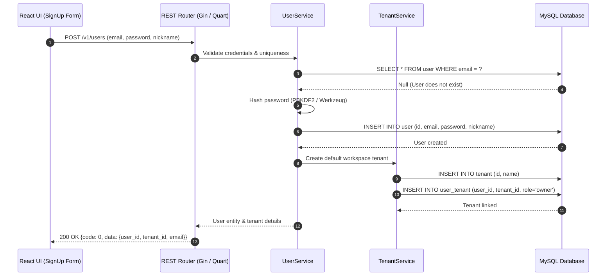

# End-to-End User Registration Flow

## Level 1: Conceptual Overview

User registration in RAGFlow is the entry point for tenant isolation and multi-user workspace management. When a new user signs up, the system must not only create a core user identity record but also automatically provision an isolated **Tenant** (workspace), establish ownership via a **UserTenant** link table, and configure default system models and default settings.

### Key Objectives
1. **Identity Provisioning**: Validate user credentials (email format, nickname constraints, unique email check) and securely hash passwords using PBKDF2/scrypt or Werkzeug security primitives.
2. **Tenant Provisioning**: Automatically generate a dedicated workspace ID (`tenant_id`) so that every registered user immediately possesses their own isolated domain for Knowledge Bases, Documents, and LLM key configurations.
3. **RBAC Initialization**: Assign the newly created user as the `Owner` of their personal tenant within the `user_tenant` junction table.

---

## Level 2: Technical Implementation Details

### API Endpoint & Routing
- **Python Flask/Quart Endpoint**: `POST /v1/users` handled by `users()` in [api/apps/restful_apis/user_api.py:L468](file:///home/logan78/Desktop/ragflow/api/apps/restful_apis/user_api.py#L468).
- **Go Gin Endpoint**: `POST /api/v1/users` handled by `Register()` in [internal/handler/user.go:L84](file:///home/logan78/Desktop/ragflow/internal/handler/user.go#L84).

### Code Call Chain
```
[React UI SignUp Form]
       │
       ▼ (HTTP POST /v1/users)
[api/apps/restful_apis/user_api.py:users()]  or  [internal/handler/user.go:Register()]
       │
       ├─► Validation: nickname & email check
       │
       ▼
[api/db/services/user_service.py:UserService.save()]  or  [internal/service/user.go:UserService.Register()]
       │
       ├─► Password Hashing: generate_password_hash() / pbkdf2
       ├─► MySQL Insert into `user` table
       ├─► Tenant Creation: TenantService.save() -> MySQL Insert into `tenant`
       └─► Link Creation: UserTenantService.save() -> MySQL Insert into `user_tenant` (role='owner')
       │
       ▼
[HTTP 200 OK Response] -> Token / User JSON Metadata
```

### Key Source Code References
- **Frontend Form**: [web/src/pages/login-next/index.tsx](file:///home/logan78/Desktop/ragflow/web/src/routes.tsx#L137)
- **Python Handler**: `users()` in [api/apps/restful_apis/user_api.py:L468](file:///home/logan78/Desktop/ragflow/api/apps/restful_apis/user_api.py#L468)
- **Python UserService**: [api/db/services/user_service.py:L30](file:///home/logan78/Desktop/ragflow/api/db/services/user_service.py#L30)
- **Go Handler**: `Register()` in [internal/handler/user.go:L84](file:///home/logan78/Desktop/ragflow/internal/handler/user.go#L84)
- **Go UserService**: `Register()` in [internal/service/user.go:L107](file:///home/logan78/Desktop/ragflow/internal/service/user.go#L107)
- **Go User DAO**: `Create()` in [internal/dao/user.go:L45](file:///home/logan78/Desktop/ragflow/internal/dao/user.go#L45)

### Database Schemas Involved
- **`user`**: `id`, `email`, `password`, `nickname`, `status`, `create_time`, `update_time`
- **`tenant`**: `id`, `name`, `public_key`, `create_time`
- **`user_tenant`**: `id`, `user_id`, `tenant_id`, `role` (e.g. `'owner'`)

---

## Sequence Diagram


