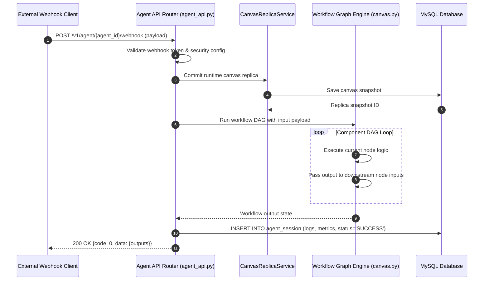

# End-to-End Workflow Execution Flow

## Level 1: Conceptual Overview

Workflow Execution represents the orchestration lifecycle for complex multi-node automation pipelines, canvas sessions, and API/webhook-triggered agent workflows in RAGFlow.

### Workflow Lifecycle Principles
1. **Runtime Replica Isolation**: Before executing a workflow session, the engine creates a snapshot replica of the canvas DSL via `CanvasReplicaService` to prevent live edits from disrupting in-flight sessions.
2. **State Context Propagation**: Shared runtime memory (`ContextVar` / runtime state dictionary) flows between nodes, allowing downstream nodes to read outputs produced by upstream nodes.
3. **Webhook & API Integration**: Workflows can be triggered synchronously via REST API endpoints or asynchronously via HTTP Webhook events (`POST /v1/agent/{agent_id}/webhook`).
4. **Session Persistence**: Execution trace logs, component runtimes, input parameters, and output artifacts are saved to `agent_session` for audit and replay.

---

## Level 2: Technical Implementation Details

### Primary Code Call Chain
```
[External Webhook Trigger / API Call]
       │
       ▼ (HTTP POST /v1/agent/<agent_id>/webhook)
[api/apps/restful_apis/agent_api.py:webhook()]
       │
       ├─► Security validation: validate_webhook_security()
       ├─► Trigger session worker: _run_workflow_session(agent_id, req) [L232]
       │
       ▼
[api/apps/restful_apis/agent_api.py:_run_workflow_session()]
       │
       ├─► Snapshot Canvas: CanvasReplicaService.commit_runtime_replica()
       ├─► Initialize Graph Context: set_llm_request_context()
       ├─► Execute Graph DSL: agent/canvas.py:Graph.run()
       ├─► Node Execution Chain: Begin -> Branch / Parallel Nodes -> End
       └─► Persist Session Results: persist_workflow_session()
       │
       ▼
[HTTP Response / Webhook Callback Payload]
```

### Source Code References
- **Workflow Session Runner**: `_run_workflow_session()` in [api/apps/restful_apis/agent_api.py:L232](file:///home/logan78/Desktop/ragflow/api/apps/restful_apis/agent_api.py#L232)
- **Webhook Endpoint**: `webhook()` in [api/apps/restful_apis/agent_api.py:L1830](file:///home/logan78/Desktop/ragflow/api/apps/restful_apis/agent_api.py#L1830)
- **Canvas Replica Service**: [api/apps/services/canvas_replica_service.py:L30](file:///home/logan78/Desktop/ragflow/api/apps/services/canvas_replica_service.py#L30)
- **Canvas Engine**: `Graph` in [agent/canvas.py:L49](file:///home/logan78/Desktop/ragflow/agent/canvas.py#L49)
- **Go Agent Engine**: [internal/agent/canvas/canvas.go:L50](file:///home/logan78/Desktop/ragflow/internal/agent/canvas/canvas.go#L50)

---

## Sequence Diagram


