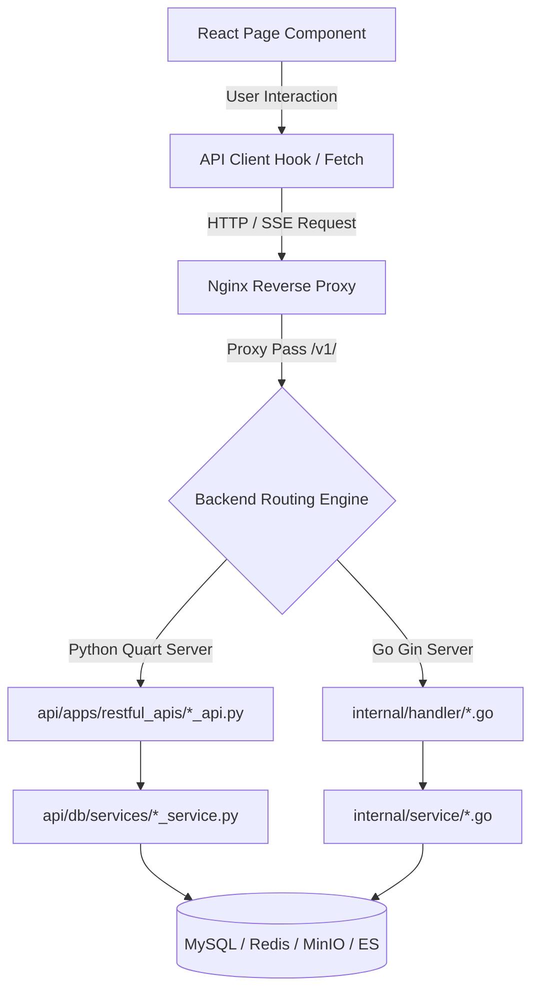

# Frontend-to-Backend Call Chain

## Level 1: Conceptual Overview

This document details the architectural path taken by network requests originating from the React frontend application down to the backend REST API handlers, service layers, and infrastructure datastores.

### Communication Architecture
1. **Frontend Router & UI Page Components**: Built using React Router and TypeScript in `web/src/`.
2. **API Client & Request Interceptors**: Standard HTTP requests wrapped with authentication headers (`Authorization: Bearer <token>`) or session cookies (`ragflow_auth`).
4. **Backend Router & Service Layer**: REST controllers parse requests, perform validation, delegate business logic to services, and access MySQL, Redis, MinIO, or Elasticsearch.

---

## Level 2: Comprehensive Code Call Chain

### Request Lifecycle Mapping

### Route-to-Backend Handler Mapping Table

| Frontend Route (`web/src/routes.tsx`) | Frontend Component | HTTP Method & Path | Backend Handler (Python) | Backend Handler (Go) |
|---|---|---|---|---|
| `/login-next` [L133](file:///home/logan78/Desktop/ragflow/web/src/routes.tsx#L133) | `pages/login-next` | `POST /v1/auth/login` | [user_api.py:L61](file:///home/logan78/Desktop/ragflow/api/apps/restful_apis/user_api.py#L61) | [user.go:L120](file:///home/logan78/Desktop/ragflow/internal/handler/user.go#L120) |
| `/datasets` [L200](file:///home/logan78/Desktop/ragflow/web/src/routes.tsx#L200) | `pages/datasets` | `GET /v1/dataset/list` | [dataset_api.py:L312](file:///home/logan78/Desktop/ragflow/api/apps/restful_apis/dataset_api.py#L312) | [dataset.go:L90](file:///home/logan78/Desktop/ragflow/internal/handler/dataset.go#L90) |
| `/dataset/files/:id` [L208](file:///home/logan78/Desktop/ragflow/web/src/routes.tsx#L208) | `pages/dataset/dataset` | `POST /api/v1/documents/upload` | [document_api.py:L452](file:///home/logan78/Desktop/ragflow/api/apps/restful_apis/document_api.py#L452) | [document.go:L75](file:///home/logan78/Desktop/ragflow/internal/handler/document.go#L75) |
| `/chat/:id` [L192](file:///home/logan78/Desktop/ragflow/web/src/routes.tsx#L192) | `pages/next-chats/chat` | `POST /v1/session/completion` | [chat_api.py:L1230](file:///home/logan78/Desktop/ragflow/api/apps/restful_apis/chat_api.py#L1230) | [chat.go:L110](file:///home/logan78/Desktop/ragflow/internal/handler/chat.go#L110) |
| `/agent/:id` [L378](file:///home/logan78/Desktop/ragflow/web/src/routes.tsx#L378) | `pages/agent` | `POST /api/v1/agents/chat/completions` | [agent_api.py:L1447](file:///home/logan78/Desktop/ragflow/api/apps/restful_apis/agent_api.py#L1447) | [canvas.go:L80](file:///home/logan78/Desktop/ragflow/internal/agent/canvas/canvas.go#L80) |

---

## Detailed Code References

- **Frontend Routes Definition**: [web/src/routes.tsx](file:///home/logan78/Desktop/ragflow/web/src/routes.tsx#L1)
- **Python App Server Entry**: [api/ragflow_server.py:L50](file:///home/logan78/Desktop/ragflow/api/ragflow_server.py#L50)
- **Python Authorization Middleware**: `login_required` decorator in [api/apps/__init__.py:L40](file:///home/logan78/Desktop/ragflow/api/apps/__init__.py#L40)
