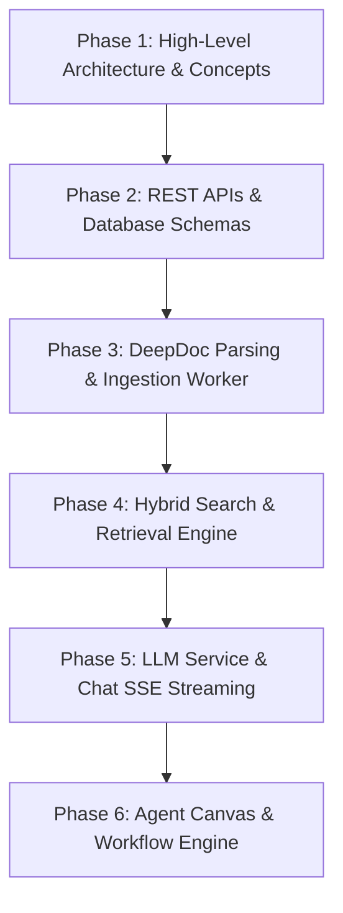

# Recommended Learning Order for RAGFlow

## Overview

To systematically master the RAGFlow architecture, developers should follow a progressive, step-by-step reading order that builds up from macro-architecture to deep engine implementations.

---

## Recommended Step-by-Step Pathway

---

## Detailed Step Breakdown

### Step 1: System Overview & Entry Points
- Read [00-overview](../00-overview/) and [21-end-to-end-flows/ragflow-one-request.md](../21-end-to-end-flows/ragflow-one-request.md).
- Inspect entry point server files:
  - Python: [api/ragflow_server.py](file:///home/logan78/Desktop/ragflow/api/ragflow_server.py#L50)
  - Frontend Routes: [web/src/routes.tsx](file:///home/logan78/Desktop/ragflow/web/src/routes.tsx#L1)

### Step 2: Database Schemas & API Layer
- Read [21-end-to-end-flows/user-registration.md](../21-end-to-end-flows/user-registration.md) and [21-end-to-end-flows/create-knowledge-base.md](../21-end-to-end-flows/create-knowledge-base.md).
- Inspect DB models in [api/db/db_models.py](file:///home/logan78/Desktop/ragflow/api/db/db_models.py#L30) and Go DAOs in `internal/dao/`.
- Study handlers: [api/apps/restful_apis/document_api.py](file:///home/logan78/Desktop/ragflow/api/apps/restful_apis/document_api.py#L452) and [internal/handler/document.go](file:///home/logan78/Desktop/ragflow/internal/handler/document.go#L75).

### Step 3: Document Processing & Worker Task Executor
- Read [21-end-to-end-flows/document-processing.md](../21-end-to-end-flows/document-processing.md) and [22-code-tracing/ingestion-call-chain.md](../22-code-tracing/ingestion-call-chain.md).
- Trace worker main loop: `main()` in [rag/svr/task_executor.py:L1904](file:///home/logan78/Desktop/ragflow/rag/svr/task_executor.py#L1904).
- Inspect DeepDoc PDF parser: [deepdoc/parser/pdf_parser.py:L50](file:///home/logan78/Desktop/ragflow/deepdoc/parser/pdf_parser.py#L50).

### Step 4: Hybrid Search & Retrieval Engine
- Read [21-end-to-end-flows/ask-question.md](../21-end-to-end-flows/ask-question.md) and [22-code-tracing/retrieval-call-chain.md](../22-code-tracing/retrieval-call-chain.md).
- Study search engine dealer: `Dealer.search()` in [rag/nlp/search.py:L134](file:///home/logan78/Desktop/ragflow/rag/nlp/search.py#L134).
- Inspect vector store connection: [rag/utils/es_conn.py:L150](file:///home/logan78/Desktop/ragflow/rag/utils/es_conn.py#L150).

### Step 5: Chat Generation & SSE Token Streaming
- Read [21-end-to-end-flows/chat-streaming.md](../21-end-to-end-flows/chat-streaming.md) and [22-code-tracing/llm-call-chain.md](../22-code-tracing/llm-call-chain.md).
- Inspect LLMBundle wrapper: `LLMBundle` in [api/db/services/llm_service.py:L35](file:///home/logan78/Desktop/ragflow/api/db/services/llm_service.py#L35).

### Step 6: Agent Canvas & Workflow Engine
- Read [21-end-to-end-flows/agent-execution.md](../21-end-to-end-flows/agent-execution.md) and [22-code-tracing/agent-call-chain.md](../22-code-tracing/agent-call-chain.md).
- Study canvas graph engine: `Graph.run()` in [agent/canvas.py:L440](file:///home/logan78/Desktop/ragflow/agent/canvas.py#L440).
